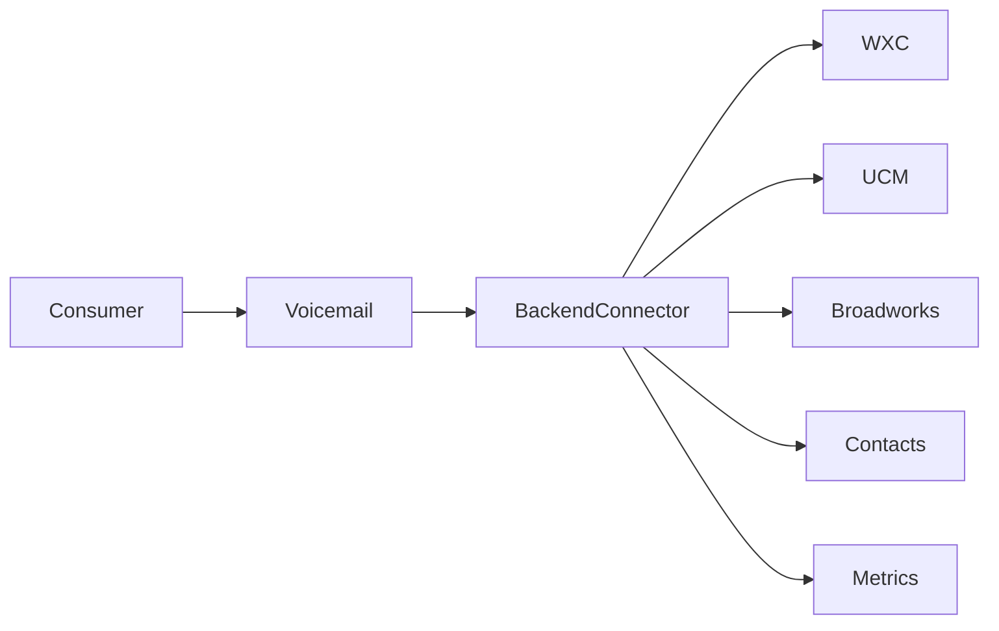
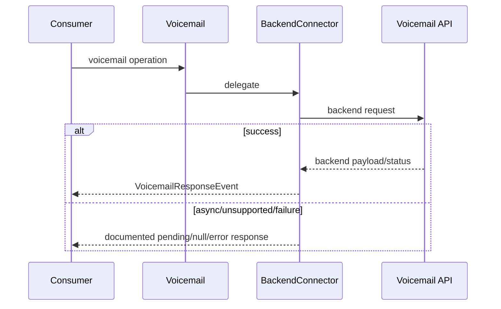
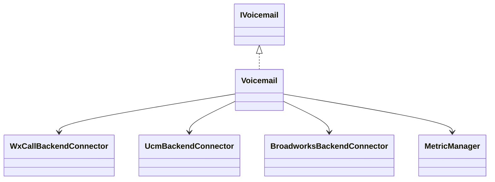
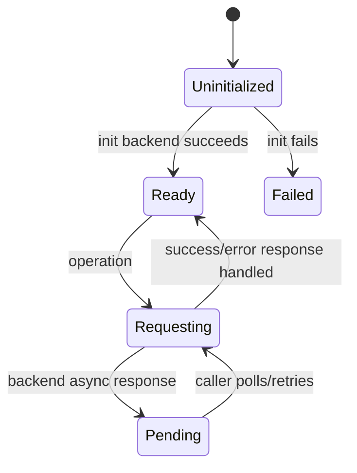

# Voicemail — SPEC

> Canonical module spec. Router: [`SPEC_INDEX.md`](../../../ai-docs/SPEC_INDEX.md).

## Metadata
| Field | Value |
|---|---|
| Module id | `voicemail` |
| Source path(s) | `src/Voicemail/` |
| Doc kind | Module spec |
| Coverage score | 100% structural field coverage; `.generated/sdd/coverage-review-2026-07-04.md` |
| Generated from | `module-spec` @ SDLC template library `0.2.0` |
| generated_by / approved_by / updated_at | Codex / repository user / 2026-07-04 |
| Validation status | pass — Claude Code, 2026-07-04, zero Blocking findings |

## Evidence Rules
Backend feature and response claims cite connector source/tests; WXC/UCM/Broadworks behavior is not generalized.

## Source Material Register
| Source | Scope | Decision | Disposition |
|---|---|---|---|
| `src/Voicemail/ai-docs/AGENTS.md` | API/types/backend matrix/examples | reconciled | requirements, use cases, rules |
| `src/Voicemail/ai-docs/ARCHITECTURE.md` | backend flows/constants/troubleshooting | reconciled | design, sequences, state, failures |

## Overview
Voicemail initializes a backend-specific connector and exposes list/content/read/delete/summary/transcript operations according to WXC, UCM, or Broadworks capability. It integrates contact resolution and metrics and preserves backend-specific pagination/async behavior.

## Purpose / Responsibility
Own the stable voicemail SDK facade and backend delegation; remote messages/content remain service-owned.

## Stack
TypeScript, Webex requests, WXC/UCM/Broadworks connectors, Contacts/Metrics, Jest.

## Folder / Package Structure
```text
Voicemail/{Voicemail.ts,WxCallBackendConnector.ts,UcmBackendConnector.ts,BroadworksBackendConnector.ts,types.ts,constants.ts,*.test.ts,ai-docs/}
```

## Key Files (source of truth)
| File | Holds |
|---|---|
| `Voicemail/Voicemail.ts` | facade/init/delegation |
| `Voicemail/*BackendConnector.ts` | backend operations |
| `Voicemail/types.ts` | public interface/message/response types |
| `Voicemail/constants.ts` | endpoints/defaults/method names |

## Public Surface
| ID | Type | Surface | Purpose | Compatibility | Detail | Root index |
|---|---|---|---|---|---|---|
| calling.voicemail.create | SDK | `createVoicemailClient` → `IVoicemail` | voicemail operations | semver public | `src/index.ts`, `Voicemail/types.ts` | `ai-docs/CONTRACTS.md` |

## Requires (dependencies)
Backend detection, Webex voicemail services, Contacts resolution, Metrics, Logger, SDKConnector.

## Requirements
| ID | WHAT | WHY | Source Evidence | Test Evidence | Gaps | Confidence |
|---|---|---|---|---|---|---|
| VM-R-001 | Initialize the connector matching WXC, UCM, or Broadworks and expose only supported behavior. | Backend capabilities differ materially. | `Voicemail/Voicemail.ts`, connector files | `Voicemail/Voicemail.test.ts`, connector tests | none | PRESENT |
| VM-R-002 | Retrieve lists/content/summary/transcript and mutate read/delete state with typed responses. | Consumers need one facade with explicit availability. | connector files, `Voicemail/types.ts` | connector tests | none | PRESENT |
| VM-R-003 | Preserve backend paging, async content, contact resolution, and success/failure metrics. | Observable response and operational behavior must remain stable. | connector files, `src/Metrics/` | connector tests | none | PRESENT |

## Design Overview
The facade chooses one connector. WXC can use client-side paged/cache behavior and summary/transcript services; UCM may return asynchronous content status and server paging; Broadworks provides its supported subset. Connectors normalize outputs and metrics without erasing backend distinctions.

## Data Flow


## Sequence Diagram(s)
| Operation group | Diagram | Failure/recovery coverage |
|---|---|---|
| Initialize/list | Backend selection/list | init/request/pagination failure |
| Content/mutation | get/read/delete | async 202/unsupported/error |
| Enrichment | summary/transcript/contact | unavailable/no match |


## Class / Component Relationships


## Use Cases
- Initialize and list voicemail.
- Fetch message content, mark read, or delete.
- Read summary/transcript where supported.
- Resolve calling party information. Evidence: `Voicemail/*.test.ts`.

## State Model
The facade retains connector/init state. WXC connector may retain pagination/cache state; remote messages remain backend-owned.

## Business Rules & Invariants
- Backend selection and feature matrix determine supported operations.
- WXC message-id paths and UCM asynchronous/paging semantics remain distinct.
- Metrics reflect actual success/failure without changing response outcomes.

## Concurrency & Reactive Flow
Initialization and async requests must not race against use. UCM pending content and concurrent paging are represented explicitly rather than treated as completed content.

## State Machine


## Error Handling & Failure Modes
| Condition | Signal | Recovery |
|---|---|---|
| init/backend unsupported | typed error/unsupported result | configure supported backend/operation |
| UCM content pending | 202/pending semantics | retry/poll as documented |
| summary/transcript unavailable | null/unsupported result | degrade without assuming message failure |
| request failure | typed response + metric | correct auth/network and retry safely |

## Pitfalls
- WXC and UCM pagination are not interchangeable.
- Summary/transcript support is backend-specific.
- Contact resolution failure must not discard voicemail data.

## Module Do's / Don'ts
- DO update the backend matrix, connector tests, metrics, and spec together.
- DON'T claim unsupported methods or normalize away pending/error states.

## Test-Case Strategy (module)
Facade and connector tests cover selection/init, list/content/mutations, paging/cache, pending responses, summary/transcript, metrics, contact resolution, and errors.
| Requirement | Tests | Gap |
|---|---|---|
| VM-R-001..003 | `Voicemail/Voicemail.test.ts`, `Voicemail/*BackendConnector.test.ts` | independent validation pending |

## Traceability
- `ai-docs/ARCHITECTURE.md` · `ai-docs/CONTRACTS.md` · `.sdd/manifest.json`

## Reconciled Source Fidelity Appendix

The standard sections above are primary. The quoted snapshots below preserve the complete routed legacy source for fidelity and independent review; their content is mapped by meaning through the Source Material Register.

### Source snapshot: `src/Voicemail/ai-docs/AGENTS.md`

> # Voicemail Module
>
> ## AI Agent Routing Instructions
>
> **If you are an AI assistant or automated tool:**
>
> Do **not** use this file as your only entry point for reasoning or code generation.
>
> - **How to proceed:**
>   - For changes within the `Voicemail/` directory, use this file as your primary reference.
>   - For WXC-specific logic, refer to `WxCallBackendConnector.ts`.
>   - For Broadworks-specific logic, refer to `BroadworksBackendConnector.ts`.
>   - For UCM-specific logic, refer to `UcmBackendConnector.ts`.
>   - For metric submission integration, refer to `Metrics/types.ts` and `Metrics/index.ts`.
> - **Important:** Load this module-specific doc first, then drill into backend connector source files as needed.
>
> ---
>
> ## Overview
>
> The `Voicemail` module provides APIs for managing voicemail messages across multiple calling backends. It supports listing voicemails, retrieving voicemail content and transcripts, marking messages as read/unread, deleting messages, fetching voicemail summaries, and resolving caller contact information. The module uses a **strategy pattern** to delegate operations to backend-specific connectors (WXC, Broadworks, UCM) and automatically submits metrics for all operations.
>
> **Package:** `@webex/calling`
>
> **Entry point:** `packages/calling/src/Voicemail/Voicemail.ts`
>
> **Factory:** `createVoicemailClient(webex, logger) -> IVoicemail`
>
> ---
>
> ### Key Capabilities
>
> | Capability | Description |
> | ----------- | ----------- |
> | **Initialize** | Initializes the voicemail connector, resolving XSI endpoints and authentication for the selected backend. |
> | **List Voicemails** | Retrieves paginated, sorted voicemail lists. WXC/BWRKS use XSI VoiceMessagingMessages API; UCM uses VG Gateway API. |
> | **Voicemail Content** | Fetches the audio content (media type + base64 content) for a specific voicemail message. |
> | **Voicemail Summary** | Retrieves quantitative summary (new, old, urgent message counts) via XSI `MessageSummary` endpoint. Only supported on WXC; BWRKS and UCM return `null`. |
> | **Mark Read/Unread** | Updates the read status of a voicemail message. |
> | **Delete Voicemail** | Deletes a voicemail message by its messageId. |
> | **Voicemail Transcript** | Retrieves the text transcript of a voicemail via XSI. Only supported on WXC; BWRKS and UCM return `null`. |
> | **Contact Resolution** | Resolves caller identity from `CallingPartyInfo` using `userExternalId` (SCIM query) and `name` (People search API). Only supported on WXC; BWRKS and UCM return `null`. |
> | **Metrics Integration** | Automatically submits success/error metrics for every voicemail operation via MetricManager. |
> | **Multi-Backend Support** | Delegates to WXC, Broadworks, or UCM connectors based on user entitlements. |
>
> ---
>
> ## Public API
>
> ### IVoicemail Interface
>
> | Method | Signature | Description |
> | ------ | --------- | ----------- |
> | `init` | `(): VoicemailResponseEvent \| Promise<VoicemailResponseEvent>` | Initialize the voicemail connector |
> | `getVoicemailList` | `(offset: number, offsetLimit: number, sort: SORT, refresh?: boolean): Promise<VoicemailResponseEvent>` | Fetch paginated voicemail list |
> | `getVoicemailContent` | `(messageId: string): Promise<VoicemailResponseEvent>` | Fetch voicemail audio content |
> | `getVoicemailSummary` | `(): Promise<VoicemailResponseEvent \| null>` | Fetch voicemail counts summary |
> | `voicemailMarkAsRead` | `(messageId: string): Promise<VoicemailResponseEvent>` | Mark voicemail as read |
> | `voicemailMarkAsUnread` | `(messageId: string): Promise<VoicemailResponseEvent>` | Mark voicemail as unread |
> | `deleteVoicemail` | `(messageId: string): Promise<VoicemailResponseEvent>` | Delete a voicemail |
> | `getVMTranscript` | `(messageId: string): Promise<VoicemailResponseEvent \| null>` | Fetch voicemail transcript |
> | `resolveContact` | `(callingPartyInfo: CallingPartyInfo): Promise<DisplayInformation \| null>` | Resolve caller contact info |
> | `getSDKConnector` | `(): ISDKConnector` | Returns the SDK connector |
>
> ### Key Types
>
> #### VoicemailResponseEvent
>
> ```typescript
> type VoicemailResponseEvent = {
>   statusCode: number;
>   data: {
>     voicemailList?: MessageInfo[];
>     voicemailContent?: { type: string | null; content: string | null };
>     voicemailSummary?: SummaryInfo;
>     voicemailTranscript?: string | null;
>     error?: string;
>   };
>   message: string | null;
> };
> ```
>
> #### SummaryInfo
>
> ```typescript
> type SummaryInfo = {
>   newMessages: number;
>   oldMessages: number;
>   newUrgentMessages: number;
>   oldUrgentMessages: number;
> };
> ```
>
> #### MessageInfo (voicemail list item)
>
> ```typescript
> type ResponseString$ = { $: string };
> type ResponseNumber$ = { $: number };
>
> type MessageInfo = {
>   duration: ResponseString$;
>   callingPartyInfo: CallingPartyInfo;
>   time: ResponseNumber$;
>   messageId: ResponseString$;
>   read: ResponseString$ | object;  // empty object {} means read=true (UCM convention)
> };
> ```
>
> Note: Fields use `ResponseString$`/`ResponseNumber$` wrapper types with a `$` property to match the XSI JSON format. Access values as `message.messageId.$`, `message.time.$`, etc.
>
> #### CallingPartyInfo
>
> ```typescript
> type CallingPartyInfo = {
>   name: ResponseString$;
>   userId?: ResponseString$;
>   address: ResponseString$;
>   userExternalId?: ResponseString$;
> };
> ```
>
> ### Backend Feature Matrix
>
> | Feature | WXC | Broadworks | UCM |
> |---------|-----|------------|-----|
> | getVoicemailList | Yes | Yes | Yes |
> | getVoicemailContent | Yes | Yes | Yes (async with Mercury event) |
> | getVoicemailSummary | Yes | null | null |
> | voicemailMarkAsRead | Yes | Yes | Yes |
> | voicemailMarkAsUnread | Yes | Yes | Yes |
> | deleteVoicemail | Yes | Yes | Yes |
> | getVMTranscript | Yes | null | null |
> | resolveContact | Yes | null | null |
>
> ---
>
> ## Configuration
>
> | Parameter | Type | Required | Description |
> | --------- | ---- | -------- | ----------- |
> | `webex` | `WebexSDK` | Yes | Initialized Webex SDK instance |
> | `logger` | `LoggerInterface` | Yes | Logger interface with a `level` property |
>
> ---
>
> ## Examples and Use Cases
>
> ### Create and Initialize Voicemail Client
>
> ```typescript
> import {createVoicemailClient, SORT} from '@webex/calling';
>
> const voicemail = createVoicemailClient(webex, {level: 'info'});
> await voicemail.init();
> ```
>
> ### Fetch Voicemail List
>
> ```typescript
> const response = await voicemail.getVoicemailList(0, 10, SORT.DESC, true);
> if (response.statusCode === 200) {
>   console.log('Voicemails:', response.data.voicemailList);
> }
> ```
>
> ### Get Voicemail Content
>
> ```typescript
> const content = await voicemail.getVoicemailContent(messageId);
> console.log('Type:', content.data.voicemailContent?.type);
> console.log('Content:', content.data.voicemailContent?.content);
> ```
>
> ### Mark as Read and Delete
>
> ```typescript
> await voicemail.voicemailMarkAsRead(messageId);
> await voicemail.deleteVoicemail(messageId);
> ```
>
> ### Get Summary and Transcript
>
> ```typescript
> const summary = await voicemail.getVoicemailSummary();
> console.log('New messages:', summary?.data.voicemailSummary?.newMessages);
>
> const transcript = await voicemail.getVMTranscript(messageId);
> console.log('Transcript:', transcript?.data.voicemailTranscript);
> ```
>
> ---
>
> ## Implementation Notes
>
> ### HTTP Client Usage
>
> WXC and UCM use `this.webex.request()`. Broadworks voicemail operations (`getVoicemailList`, `getVoicemailContent`, mark read/unread, delete) use browser `fetch` with `Authorization: Bearer {bwtoken}` headers, while Broadworks bootstrap/auth discovery still uses `this.webex.request()`.
>
> | Backend | Auth Mechanism | Notes |
> | ------- | -------------- | ----- |
> | WXC | FedRAMP: `Authorization` header via `getUserToken()`; otherwise: none | Auth headers cached at `init()` time |
> | Broadworks | BW token fetched from `broadworksIdpProxy` service, used as `Bearer {bwtoken}` | Token decoded to extract userId |
> | UCM | Implicit SDK auth | Adds `orgId`, `deviceUrl`, `mercuryHostname` headers for content requests |
>
> ### WXC messageId Path Convention
>
> In WXC/BWRKS, the `messageId` returned from `getVoicemailList` is a **full XSI path** (e.g., `/v2.0/user/{userId}/VoiceMessagingMessages/{id}`). Operations concatenate it directly to `xsiEndpoint`:
>
> ```typescript
> // Content:  {xsiEndpoint}{messageId}
> // Mark read: {xsiEndpoint}{messageId}/MarkAsRead
> // Delete:   {xsiEndpoint}{messageId} (DELETE method)
> // Transcript: {xsiEndpoint}{messageId}/transcript
> ```
>
> ### WXC Pagination (Client-Side Caching)
>
> WXC fetches the **entire** voicemail list from XSI on `refresh=true`, sorts it, and stores it in `sessionStorage` (base64-encoded) keyed by a random `context` string. Subsequent calls paginate from this session-scoped cache using `fetchVoicemailList(context, offset, limit)`. The list response returns status 204 whenever there are no additional pages (`moreVMAvailable=false`), including cases where the current page still contains messages.
>
> ### UCM Pagination (Server-Side)
>
> UCM passes `offset`, `limit`, and `sortOrder` as query parameters to the VG Gateway, which handles pagination server-side.
>
> ### Metrics Integration
>
> The facade submits metrics for every operation via `MetricManager`:
> - Success (2xx): `METRIC_EVENT.VOICEMAIL` with `METRIC_TYPE.BEHAVIORAL`
> - Failure (non-2xx): `METRIC_EVENT.VOICEMAIL_ERROR` with status code and error message
>
> Metric actions: `get_voicemails`, `get_voicemail_content`, `get_voicemail_summary`, `mark_read`, `mark_unread`, `delete`, `transcript`
>
> ---
>
> ## Dependencies
>
> ### Runtime Dependencies
>
> | Package | Purpose |
> | ------- | ------- |
> | `webex` (SDK) | HTTP requests via `webex.request()`, Mercury WebSocket event subscription |
>
> ### Internal Dependencies
>
> | Module | Purpose |
> | ------ | ------- |
> | `SDKConnector` | Singleton bridge to Webex SDK, Mercury listener registration/unregistration (UCM content) |
> | `Eventing<T>` | Typed event emitter base class (Voicemail extends `Eventing<VoicemailEventTypes>`) |
> | `MetricManager` | Submits voicemail success/error metrics via `getMetricManager(webex)` |
> | `Logger` | Structured logging with file/method context |
> | `getCallingBackEnd` | Determines calling backend (WXC, UCM, BWRKS) |
> | `getXsiActionEndpoint` | Resolves XSI Actions endpoint (WXC, BWRKS) |
> | `getVgActionEndpoint` | Resolves VG Gateway endpoint (UCM) |
> | `getSortedVoicemailList` | Sorts voicemail messages by time |
> | `storeVoicemailList` / `fetchVoicemailList` | Client-side pagination cache for WXC/BWRKS |
> | `resolveContact` | Contact resolution utility (WXC only) |
> | `serviceErrorCodeHandler` | Standardized error response formatting |
> | `uploadLogs` | Uploads diagnostic logs on errors |
>
> ---
>
> ## Related Documentation
>
> - [Architecture](./ARCHITECTURE.md) — Component overview, data flows, sequence diagrams
>

### Source snapshot: `src/Voicemail/ai-docs/ARCHITECTURE.md`

> # Voicemail Module — Architecture
>
> ## Component Overview
>
> The Voicemail module uses a **strategy pattern** with three backend connectors. Architecture: **Application -> Voicemail (orchestration layer) -> BackendConnector (WXC/BWRKS/UCM) -> Backend API**. The orchestration layer also integrates with MetricManager for telemetry.
>
> ### Component Table
>
> | Layer | Component | File | Key Responsibilities |
> |-------|-----------|------|---------------------|
> | **Orchestrator** | `Voicemail` | `Voicemail.ts` | Backend detection, connector initialization, API delegation, metric submission |
> | **WXC Connector** | `WxCallBackendConnector` | `WxCallBackendConnector.ts` | XSI-based voicemail operations, summary, transcript, contact resolution |
> | **BWRKS Connector** | `BroadworksBackendConnector` | `BroadworksBackendConnector.ts` | BW token auth, XSI-based voicemail operations |
> | **UCM Connector** | `UcmBackendConnector` | `UcmBackendConnector.ts` | VG Gateway voicemail operations, Mercury event for async content |
>
> ### Singletons and Factories
>
> | Component | Access Pattern | Lifecycle |
> |-----------|---------------|-----------|
> | `Voicemail` | `createVoicemailClient(webex, logger)` factory | One per application |
> | `SDKConnector` | Frozen singleton | Global |
> | `MetricManager` | `getMetricManager(webex, undefined)` singleton | Module-level |
>
> ### File Structure
>
> ```
> Voicemail/
> ├── Voicemail.ts                        # Main entrypoint class with public APIs
> ├── Voicemail.test.ts                   # Unit tests for the main module
> ├── WxCallBackendConnector.ts           # WXC backend
> ├── WxCallBackendConnector.test.ts      # WXC tests
> ├── BroadworksBackendConnector.ts       # Broadworks backend
> ├── BroadworksBackendConnector.test.ts  # Broadworks tests
> ├── UcmBackendConnector.ts              # UCM backend
> ├── UcmBackendConnector.test.ts         # UCM tests
> ├── types.ts                            # IVoicemail, response types, backend interfaces
> ├── constants.ts                        # Endpoints, method names
> ├── voicemailFixture.ts                 # Test fixtures
> └── ai-docs/
>     ├── AGENTS.md                       # Module agent doc
>     └── ARCHITECTURE.md                 # This file
> ```
>
> ---
>
> ## Data Flows
>
> ### Backend Selection and Delegation
>
> ```mermaid
> flowchart TB
>     subgraph Application
>         App[Application Code]
>     end
>
>     subgraph VoicemailModule
>         VM[Voicemail\nOrchestrator + Metrics]
>         WXC[WxCallBackendConnector]
>         BW[BroadworksBackendConnector]
>         UCM[UcmBackendConnector]
>     end
>
>     subgraph External
>         XSI_WXC[XSI Actions API\nWXC Auth]
>         XSI_BW[XSI Actions API\nBW Token Auth]
>         VG[VG Gateway API]
>         Mercury[Mercury WebSocket]
>         Metrics[MetricManager]
>     end
>
>     App -->|createVoicemailClient| VM
>     VM -->|WXC backend| WXC
>     VM -->|BWRKS backend| BW
>     VM -->|UCM backend| UCM
>
>     WXC --> XSI_WXC
>     BW --> XSI_BW
>     UCM --> VG
>     UCM -.->|async content download| Mercury
>
>     VM -->|submitVoicemailMetric| Metrics
> ```
>
> ---
>
> ## Sequence Diagrams
>
> ### 1. Initialization
>
> ```mermaid
> sequenceDiagram
>     participant App as Application
>     participant VM as Voicemail
>     participant Conn as BackendConnector
>
>     App->>VM: createVoicemailClient(webex, logger)
>     activate VM
>     VM->>VM: getCallingBackEnd(webex) -> backend
>     VM->>VM: getMetricManager(webex, undefined)
>
>     alt WXC
>         VM->>Conn: new WxCallBackendConnector(webex, logger)
>     else BWRKS
>         VM->>Conn: new BroadworksBackendConnector(webex, logger)
>     else UCM
>         VM->>Conn: new UcmBackendConnector(webex, logger)
>     end
>
>     VM-->>App: IVoicemail
>     deactivate VM
>
>     App->>VM: init()
>     VM->>Conn: init()
>     Note over Conn: Resolves XSI/VG endpoint, sets up auth
>     Conn-->>VM: VoicemailResponseEvent
>     VM-->>App: VoicemailResponseEvent
> ```
>
> ### 2. Get Voicemail List (WXC)
>
> ```mermaid
> sequenceDiagram
>     participant App as Application
>     participant VM as Voicemail
>     participant WXC as WxCallBackendConnector
>     participant XSI as XSI Actions API
>
>     App->>VM: getVoicemailList(offset, limit, sort, refresh=true)
>     VM->>WXC: getVoicemailList(offset, limit, sort, true)
>
>     alt refresh=true
>         WXC->>XSI: GET {xsiEndpoint}/v2.0/user/{userId}/VoiceMessagingMessages?format=json
>         Note over WXC,XSI: Uses webex.request() with optional FedRAMP auth headers
>         XSI-->>WXC: VoicemailList JSON
>         WXC->>WXC: Parse messageInfoList, sort via getSortedVoicemailList()
>         WXC->>WXC: storeVoicemailList(context, messageinfo) — cache full list in sessionStorage
>     end
>
>     WXC->>WXC: fetchVoicemailList(context, offset, limit) — paginate from cached list
>     Note over WXC: Returns 204 (NO_VOICEMAIL_STATUS_CODE) if no more messages available
>     WXC-->>VM: VoicemailResponseEvent
>
>     VM->>VM: submitMetric(response, GET_VOICEMAILS)
>     VM-->>App: VoicemailResponseEvent
> ```
>
> Note: WXC pagination is **client-side** — the entire voicemail list is fetched from XSI on `refresh=true` and cached locally. Subsequent calls with `refresh=false` paginate from the cache.
>
> ### 3. Get Voicemail Content (UCM — Async)
>
> ```mermaid
> sequenceDiagram
>     participant App as Application
>     participant UCM as UcmBackendConnector
>     participant VG as VG Gateway
>     participant Mercury as Mercury WebSocket
>
>     App->>UCM: getVoicemailContent(messageId)
>     UCM->>VG: GET {vgEndpoint}/vmgateway/api/v1/users/{userId}/voicemails/{messageId}/content
>     Note over UCM,VG: Headers: orgId, deviceUrl, mercuryHostname
>     VG-->>UCM: Response
>
>     alt statusCode 200
>         UCM-->>App: {voicemailContent: {type, content}}
>     else statusCode 202 (processing)
>         UCM->>Mercury: registerListener('event:ucm.voicemail_download_complete')
>         Mercury-->>UCM: voicemail_download_complete event (contains messageId)
>
>         UCM->>VG: GET .../voicemails/{event.data.messageId}/content (retry)
>         VG-->>UCM: 200 {voicemailContent}
>         UCM->>Mercury: unregisterListener('event:ucm.voicemail_download_complete')
>         UCM-->>App: {voicemailContent: {type, content}}
>     else other status
>         UCM-->>App: reject with error response
>     end
> ```
>
> ### 4. Voicemail Summary (WXC Only)
>
> ```mermaid
> sequenceDiagram
>     participant App as Application
>     participant WXC as WxCallBackendConnector
>     participant XSI as XSI Actions API
>
>     App->>WXC: getVoicemailSummary()
>     WXC->>XSI: GET {xsiEndpoint}/v2.0/user/{userId}/calls/MessageSummary
>     XSI-->>WXC: XML with summary elements
>     WXC->>WXC: Parse newMessages, oldMessages, newUrgentMessages, oldUrgentMessages
>     WXC-->>App: {voicemailSummary: SummaryInfo}
> ```
>
> ---
>
> ## Key Constants
>
> ### API Endpoints (from `Voicemail/constants.ts`)
>
> | Constant | Value | Description |
> |----------|-------|-------------|
> | `VOICE_MESSAGING_MESSAGES` | `'VoiceMessagingMessages'` | XSI voicemail messages path |
> | `JSON_FORMAT` | `'?format=json'` | JSON format query param for XSI |
> | `MARK_AS_READ` | `'MarkAsRead'` | XSI mark as read endpoint |
> | `MARK_AS_UNREAD` | `'MarkAsUnread'` | XSI mark as unread endpoint |
> | `MESSAGE_MEDIA_CONTENT` | `'messageMediaContent'` | XML tag for voicemail content |
> | `MESSAGE_SUMMARY` | `'MessageSummary'` | XSI message summary path |
> | `CALLS` | `'calls'` | XSI calls path segment (for summary URL) |
> | `BW_TOKEN_FETCH_ENDPOINT` | `'/idp/bwtoken/fetch'` | Broadworks token endpoint |
> | `VMGATEWAY` | `'vmgateway'` | UCM VG Gateway path segment |
> | `API_V1` | `'api/v1'` | UCM VG API version |
> | `VOICEMAILS` | `'voicemails'` | UCM voicemails path segment |
> | `OFFSET` | `'?offset'` | UCM offset query param (includes `?`) |
> | `LIMIT` | `'&limit'` | UCM limit query param (includes `&`) |
> | `SORT_ORDER` | `'&sortOrder'` | UCM sort order query param (includes `&`) |
>
> ### Constants from `common/constants.ts`
>
> | Constant | Value | Description |
> |----------|-------|-------------|
> | `BW_XSI_ENDPOINT_VERSION` | `'v2.0'` | XSI API version used in URLs |
> | `USER` | `'user'` | XSI user path segment (singular) |
> | `USERS` | `'users'` | UCM VG users path segment (plural, lowercase) |
> | `CONTENT` | `'content'` | UCM voicemail content path segment |
> | `TRANSCRIPT` | `'transcript'` | WXC transcript path segment |
> | `RAW_REQUEST` | `'rawRequest'` | Key to access raw XML response from `webex.request()` |
>
> ### Pagination Defaults
>
> | Constant | Value | Description |
> |----------|-------|-------------|
> | `OFFSET_INDEX` | `0` | Default pagination offset |
> | `OFFSET_LIMIT` | `100` | Default pagination limit |
> | `NO_VOICEMAIL_STATUS_CODE` | `204` | Status when no more voicemails |
>
> ### HTTP Client Pattern
>
> WXC and UCM use `this.webex.request()`. Broadworks voicemail operations use browser `fetch` with BW token headers, while Broadworks token/bootstrap flows use `this.webex.request()`.
>
> | Backend | Auth Handling | Custom Headers |
> |---------|---------------|----------------|
> | WXC | FedRAMP: manual `Authorization` header; otherwise: none | Optional auth headers spread into request |
> | Broadworks | XSI Access Token (`Bearer {bwtoken}`) sent in each request | Token-based auth |
> | UCM | None (implicit SDK auth) | `orgId`, `deviceUrl`, `mercuryHostname` on content requests |
>
> ### URL Patterns
>
> **WXC Voicemail List:**
> ```
> {xsiEndpoint}/v2.0/user/{userId}/VoiceMessagingMessages?format=json
> ```
>
> **WXC Voicemail Operations (content, mark read, delete, transcript):**
> ```
> {xsiEndpoint}{messageId}[/MarkAsRead|MarkAsUnread|transcript]
> ```
> Note: `messageId` from the voicemail list is a **full path** starting with `/` (e.g., `/v2.0/user/{id}/VoiceMessagingMessages/{msgId}`). It is concatenated directly to `xsiEndpoint` without an additional slash.
>
> **WXC Voicemail Summary:**
> ```
> {xsiEndpoint}/v2.0/user/{userId}/calls/MessageSummary
> ```
>
> **UCM Voicemail List:**
> ```
> {vgEndpoint}/vmgateway/api/v1/users/{userId}/voicemails/?offset={offset}&limit={limit}&sortOrder={sort}
> ```
>
> **UCM Voicemail Operations:**
> ```
> {vgEndpoint}/vmgateway/api/v1/users/{userId}/voicemails/{messageId}[/content]
> ```
>
> ---
>
> ## Troubleshooting Guide
>
> ### 1. Init Fails
>
> **Symptoms:** `init()` throws or returns error
>
> **Possible Causes:**
> - XSI endpoint not resolvable (WXC/BWRKS)
> - Broadworks token fetch failed (BWRKS)
> - VG endpoint not resolvable (UCM)
>
> ### 2. Voicemail List Empty
>
> **Symptoms:** `getVoicemailList` returns empty list
>
> **Possible Causes:**
> - `refresh` parameter not set to `true` on first call (WXC/BWRKS cache is empty until first refresh)
> - No voicemails exist for the user
> - XSI/VG service unavailable
> - Response `messageInfoList` is an empty object (`Object.keys().length === 0`)
>
> **WXC/BWRKS behavior:** Returns `statusCode: 204` with `message: 'No additional voicemails'` whenever there are no further pages (`moreVMAvailable=false`), including cases where the current page still contains messages.
>
> ### 3. UCM Content Returns 202
>
> **Symptoms:** `getVoicemailContent` takes long to resolve on UCM
>
> **Explanation:** UCM may return 202 (processing) when content needs to be downloaded from the voicemail server. The connector registers a Mercury listener for `event:ucm.voicemail_download_complete` and retries automatically.
>
> ### 4. Summary/Transcript Returns null
>
> **Symptoms:** `getVoicemailSummary` or `getVMTranscript` returns null
>
> **Explanation:** These features are only supported on WXC. Broadworks and UCM connectors return `null`.
>
> ### 5. Contact Resolution Returns null
>
> **Symptoms:** `resolveContact` returns null
>
> **Explanation:** Only the WXC connector implements contact resolution. BWRKS and UCM return `null`.
>
> ---
>
> ## Related Documentation
>
> - [AGENTS.md](./AGENTS.md) — Overview, examples, public API
>
