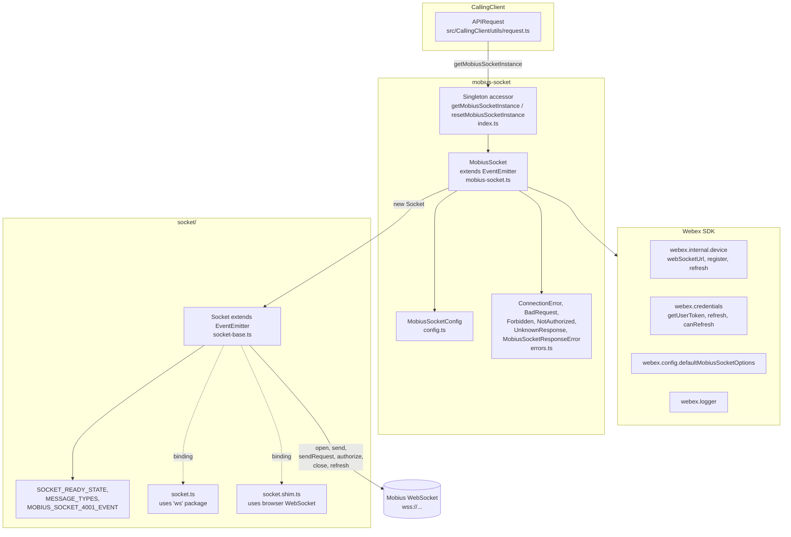
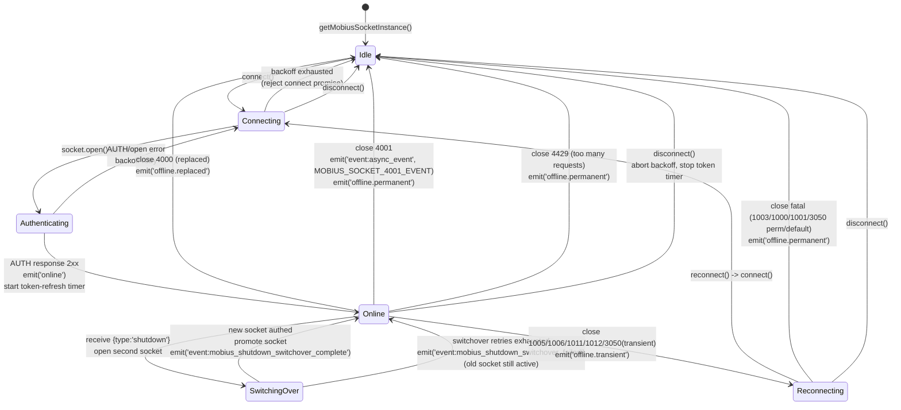
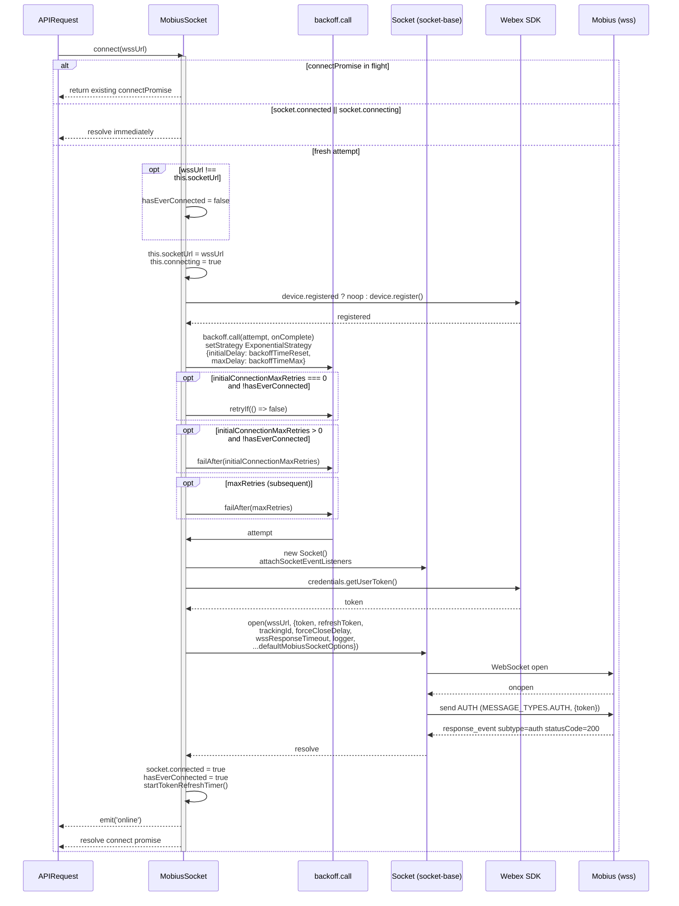
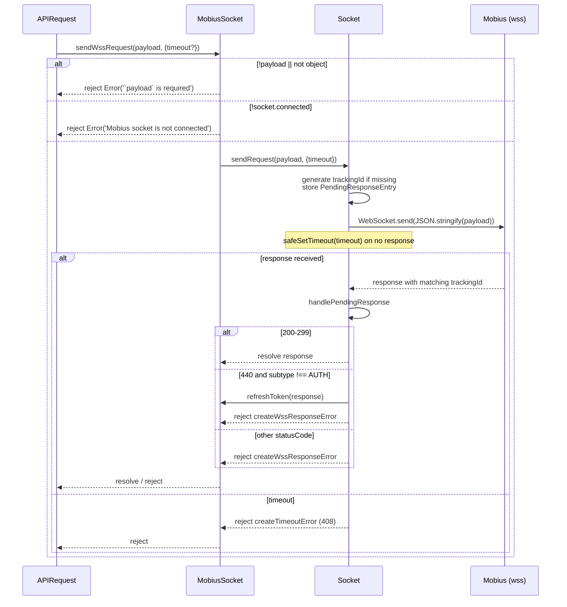
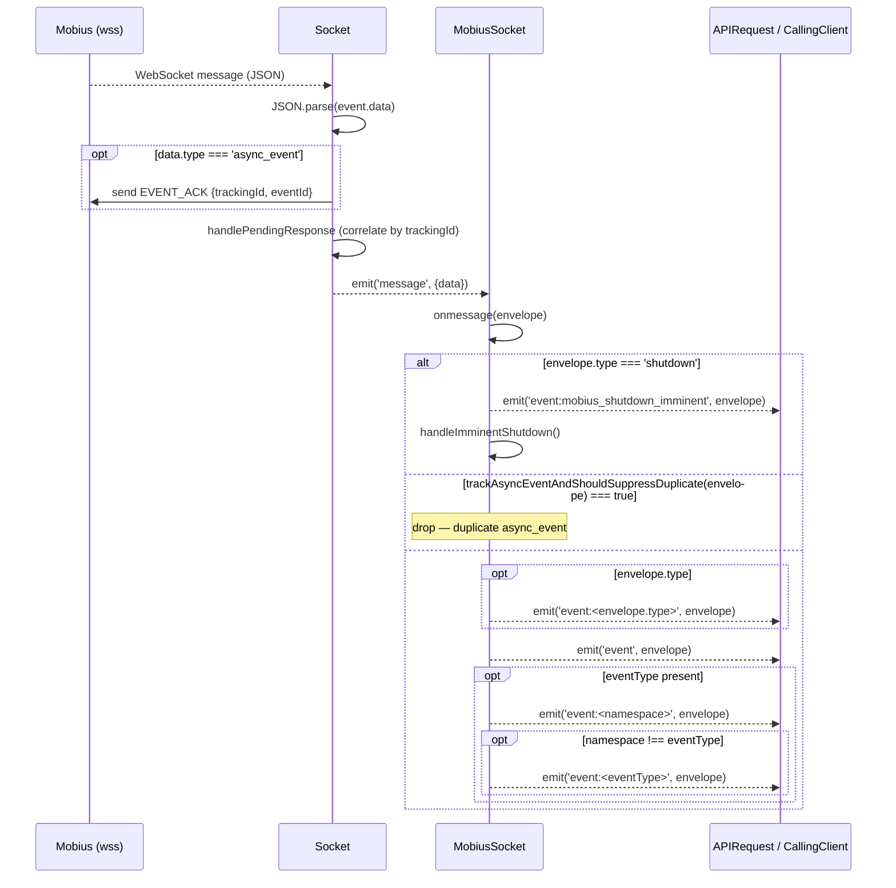
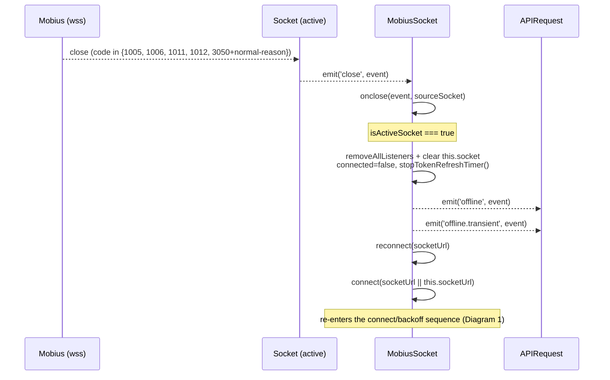
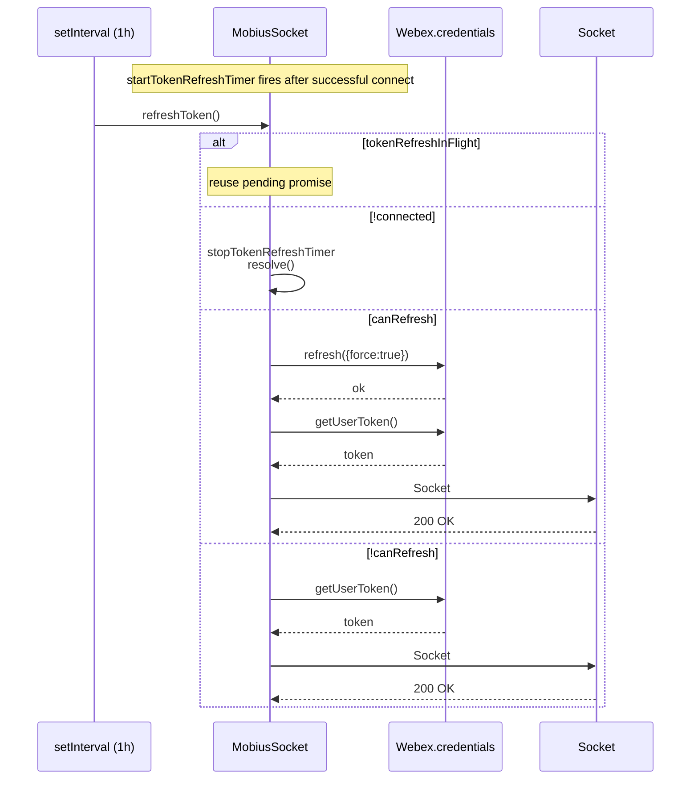
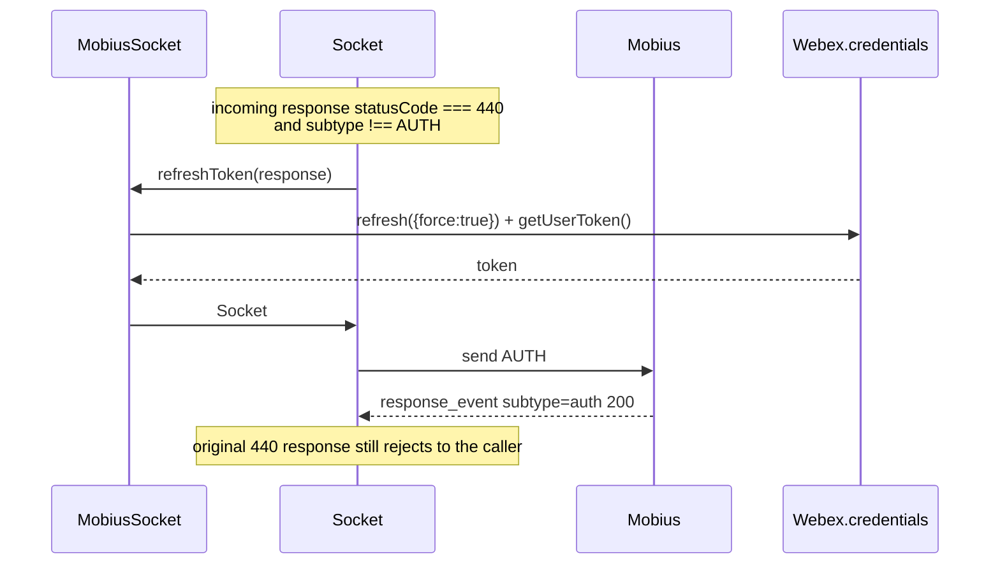
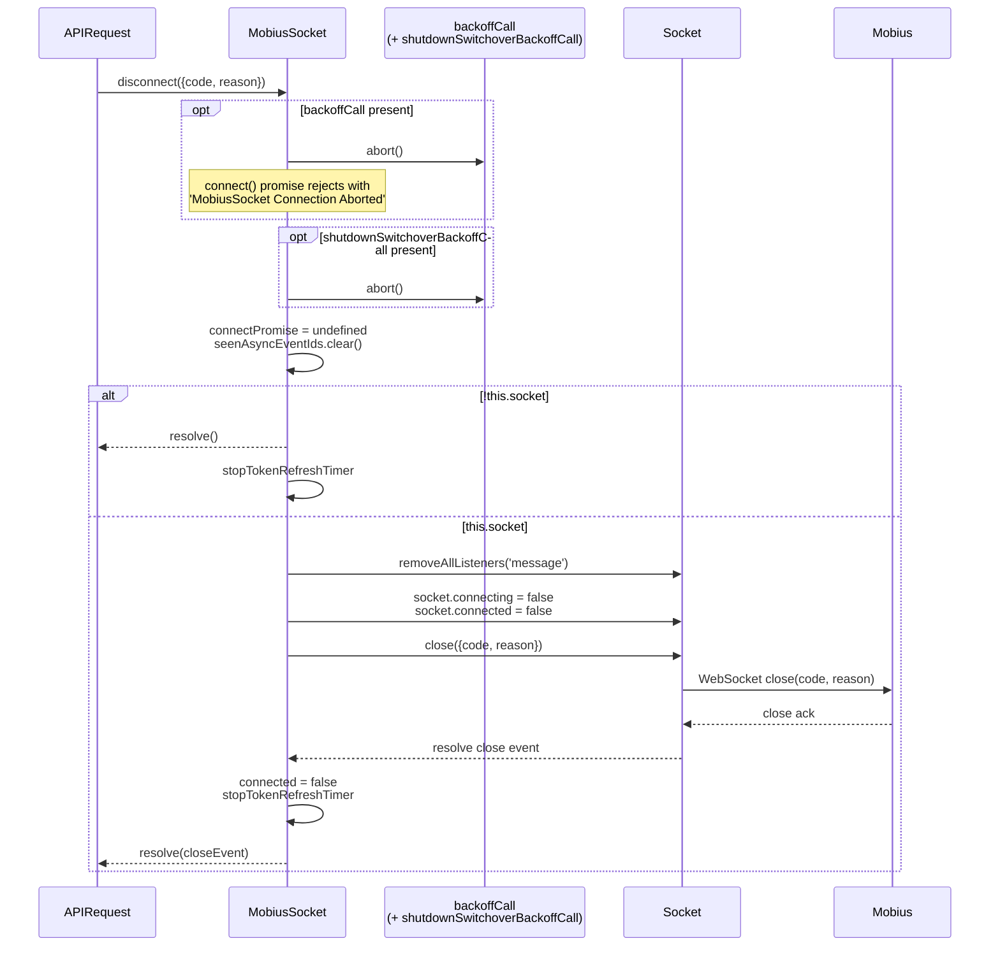
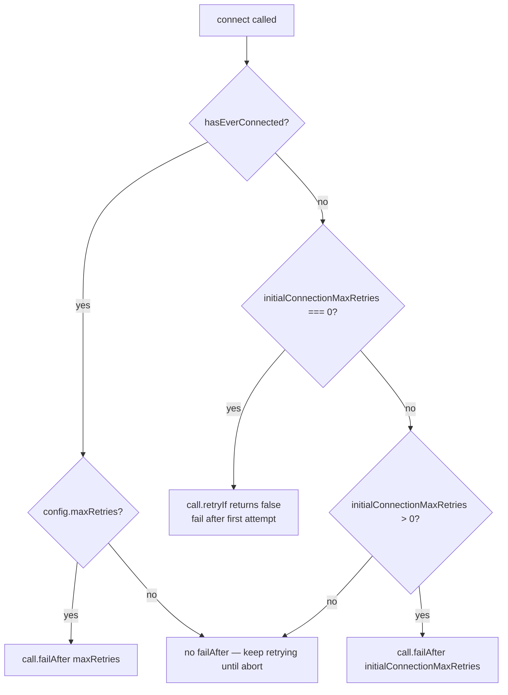

# mobius-socket Module — Architecture

## Component Overview

`mobius-socket` is a thin transport package layered on top of a generalised WebSocket abstraction. The class diagram below summarises the layering:



| Layer | Component | File | Responsibility |
|---|---|---|---|
| **Singleton** | `getMobiusSocketInstance`, `resetMobiusSocketInstance` | `index.ts` | Cache and expose a single `MobiusSocket` per process. |
| **Orchestration** | `MobiusSocket` | `mobius-socket.ts` | Connect lifecycle, retry/backoff, reconnect policy, token refresh, shutdown switchover, dedup, event fan-out. |
| **Configuration** | `MobiusSocketConfig` | `config.ts` | Timer/retry/cache defaults; merge target for caller overrides. |
| **Error model** | `ConnectionError` subclasses, `MobiusSocketResponseError` | `errors.ts` | Type-discriminated handling of `Socket#open` failures and per-request errors. |
| **Public types** | `MobiusSocketRequestPayload`, `MobiusSocketRequestOptions`, `MobiusSocketCloseOptions`, `MobiusSocketDisconnectResult` | `types.ts` | API contract for `sendWssRequest` and `disconnect`. |
| **Transport core** | `Socket` | `socket/socket-base.ts` | WebSocket connection, request/response correlation by `trackingId`, AUTH handshake, force-close, token re-auth. |
| **Env binding** | `Socket.getWebSocketConstructor` | `socket/socket.ts` (Node), `socket/socket.shim.ts` (Browser) | Returns the appropriate `WebSocket` constructor. |
| **Constants** | `SOCKET_READY_STATE`, `MESSAGE_TYPES`, `MOBIUS_SOCKET_4001_EVENT` | `socket/constants.ts` | Ready states, AUTH / EVENT_ACK type strings, synthetic 4001 envelope. |

> The `socket/` and `test/` subdirectories do **not** carry their own `ai-docs/` folders — all relevant detail lives in this file (per the documentation directive).

---

## File Structure

```
mobius-socket/
├── index.ts                            # Singleton + default export
├── mobius-socket.ts                    # MobiusSocket class
├── config.ts                           # MobiusSocketConfig + defaults
├── errors.ts                           # Connection + response error classes
├── types.ts                            # Public type aliases
├── socket/
│   ├── index.ts                        # Re-exports the env-appropriate Socket
│   ├── socket.ts                       # Node binding (`ws`)
│   ├── socket.shim.ts                  # Browser binding
│   ├── socket-base.ts                  # Generalised Socket abstraction
│   ├── constants.ts                    # Ready states, message types, 4001 event
│   └── types.ts                        # Socket-level type aliases
├── test/
│   ├── mocha-helpers.ts                # Shared test setup
│   └── promise-tick.ts                 # Promise-tick helper
├── mobius-socket.test.ts
├── mobius-socket-events.test.ts
├── socket.test.ts
├── errors.test.ts
└── ai-docs/
    ├── AGENTS.md
    └── ARCHITECTURE.md                 # This file
```

---

## Lifecycle State Diagram



---

## Internal Architecture

```mermaid
graph TD
    subgraph MobiusSocket[MobiusSocket]
        C[connect] -->|prepare token + URL| PO[prepareAndOpenSocket]
        PO --> AS[Socket.open]
        AS --> AUTH[Socket.authorize<br/>(MESSAGE_TYPES.AUTH)]
        AUTH --> READY{Auth OK?}
        READY -->|yes| ONLINE[emit 'online'<br/>start token refresh<br/>set socket.connected=true]
        READY -->|no| ERRBR{Error type}

        ERRBR -->|UnknownResponse| DEV[webex.internal.device.refresh]
        ERRBR -->|NotAuthorized| TOK[webex.credentials.refresh force:true]
        ERRBR -->|BadRequest/Forbidden| ABORT[backoffCall.abort]
        ERRBR -->|other| RETRY[backoff retry]

        DEV --> RETRY
        TOK --> RETRY
        RETRY --> AS

        OM[onmessage] --> SHUTDOWN{type=='shutdown'?}
        SHUTDOWN -->|yes| SW[handleImminentShutdown<br/>open replacement socket]
        SHUTDOWN -->|no| DEDUP{trackAsyncEventAndShouldSuppressDuplicate}
        DEDUP -->|duplicate| DROP[drop envelope]
        DEDUP -->|new/none| FAN[emit event:type / event:namespace / event:eventType / event]

        OC[onclose] --> ACT{isActiveSocket?}
        ACT -->|yes| TEARDOWN[set offline,<br/>stop token timer,<br/>emit 'offline']
        ACT -->|no| OLD[non-active old socket —<br/>ignore state change;<br/>clean up listeners]

        TEARDOWN --> CC[switch on event.code]
        OLD --> CC

        CC -->|1003,1000,1001,default| PERM[emit offline.permanent<br/>— active socket only]
        CC -->|4000| REPL[emit offline.replaced<br/>— active socket only]
        CC -->|4001| EVT[emit event:async_event MOBIUS_SOCKET_4001_EVENT<br/>— always, both active and non-active<br/>emit offline.permanent — active socket only]
        CC -->|1005,1006,1011,1012| TR[emit offline.transient + reconnect<br/>— active socket only]
        CC -->|3050+normal reason| TR
        CC -->|3050+other reason| PERM
        CC -->|4401,4403,4404| RTH[refreshToken<br/>reconnect]
        CC -->|4429| TOOMANY[emit offline.permanent<br/>— active socket only;<br/>no reconnect]
    end
```

---

## Sequence Diagrams

### 1. Initial Connect with Backoff



### 2. Send Request (sendWssRequest)



### 3. Incoming Message Dispatch



### 4. Shutdown Switchover (Make-Before-Break)

```mermaid
sequenceDiagram
    participant Mob as Mobius (wss)
    participant MS as MobiusSocket
    participant Old as Socket (old)
    participant New as Socket (new)
    participant App as APIRequest

    Mob-->>Old: {type: 'shutdown'}
    Old-->>MS: emit('message')
    MS-->>App: emit('event:mobius_shutdown_imminent', envelope)
    MS->>MS: handleImminentShutdown()

    alt shutdownSwitchoverBackoffCall in flight
        Note over MS: no-op
    else
        MS->>New: new Socket() — connecting=true<br/>(NOT promoted to this.socket yet)
        MS->>New: prepareAndOpenSocket(switchover=true)
        New->>Mob: WebSocket open + AUTH
        Mob-->>New: AUTH 200
        New-->>MS: onSuccess callback
        MS->>MS: promote new socket<br/>this.socket = New<br/>connected = true
        MS-->>App: emit('event:mobius_shutdown_switchover_complete', {url})
        Note over MS: old socket retained;<br/>server will close it with 4001

        Mob-->>Old: close 4001
        Old-->>MS: onclose(event, oldSocket)
        Note over MS: isActiveSocket === false<br/>do NOT flip connection state
        MS-->>App: emit('event:async_event', MOBIUS_SOCKET_4001_EVENT)
    end

    alt switchover backoff exhausted
        MS-->>App: emit('event:mobius_shutdown_switchover_failed', {reason})
        Note over MS: normal reconnect path will eventually re-establish<br/>once old socket is closed
    end
```

### 5. Reconnect on Transient Close



### 6. Reconnect on Auth Close (4401 / 4403 / 4404)

```mermaid
sequenceDiagram
    participant Mob as Mobius (wss)
    participant S as Socket (active)
    participant MS as MobiusSocket
    participant App as APIRequest

    Mob-->>S: close 4401/4403/4404
    S-->>MS: emit('close', event)
    MS->>MS: onclose(event, sourceSocket)
    Note over MS: isActiveSocket === true:<br/>removeAllListeners(), this.socket = undefined,<br/>emit('offline'), connected = false
    MS->>MS: refreshToken()
    Note over MS: !this.connected → early return<br/>(socket already gone; no credential<br/>refresh or Socket#refresh attempted)
    MS->>MS: reconnect(this.socket?.url)<br/>→ connect(this.socketUrl)
    Note over MS: this.socket is undefined so url arg is<br/>undefined; connect() falls back to<br/>cached this.socketUrl
    MS->>App: re-enters connect/backoff sequence (Diagram 1)
```

### 7. Periodic Token Refresh



### 8. Inline Token Refresh (status 440)



### 9. Disconnect



---

## Async-Event Dedup Cache

```mermaid
flowchart LR
    A[onmessage envelope] --> B{type === 'async_event'<br/>&& eventId?}
    B -- no --> Z[continue: not a dedup candidate]
    B -- yes --> C{seenAsyncEventIds.has eventId?}
    C -- yes --> D[delete + set again<br/>(refresh LRU)]
    D --> SUP[return true → drop envelope]
    C -- no --> E[seenAsyncEventIds.set eventId, true]
    E --> F{size > dedupCacheMaxSize?}
    F -- yes --> G[evict oldest (Map.keys().next())]
    F -- no --> Z2[fall through]
    G --> Z2
    Z2 --> H[continue dispatch]
```

- Backed by a JavaScript `Map`, exploiting its insertion-order iteration to behave as an LRU.
- Cleared on `disconnect()`.
- Each repeated `eventId` refreshes its LRU position by `delete` + `set`.

---

## Close-Code → Behaviour Matrix

| Close code(s) | Source | `MobiusSocket` action | Events emitted (active socket only unless noted) |
|---|---|---|---|
| `1000`, `1001` | clean close, going away | mark offline | `offline`, `offline.permanent` |
| `1003` | service rejected last message | no reconnect | `offline`, `offline.permanent` |
| `1005`, `1006`, `1011`, `1012` | abnormal / endpoint error | reconnect | `offline`, `offline.transient` |
| `3050` (`'idle'` / `'done (forced)'`) | normal disconnect with idle/forced reason | reconnect | `offline`, `offline.transient` |
| `3050` (other reason) | permanent disconnect | no reconnect | `offline`, `offline.permanent` |
| `4000` | server replaced the connection | no reconnect | `offline`, `offline.replaced` |
| `4001` | Mobius-specific registration-down signal | no reconnect; synthesise async event | `offline` (active only), `offline.permanent` (active only), `event:async_event` (always — both active and non-active sockets) |
| `4401`, `4403`, `4404` | auth-class failures during the session | refresh token, then reconnect | `offline` (active only) — no specific offline.* variant |
| `4429` | too many requests | no reconnect | `offline` (active only), `offline.permanent` (active only) |
| `4400` | bad request (caught during `Socket#open`) | aborts the backoff call (via `BadRequest`) | none — surfaced as `connect()` rejection |
| default | any other code | no reconnect | `offline`, `offline.permanent` |

---

## Constants

| Constant | Value | Source | Description |
|---|---|---|---|
| `TOKEN_REFRESH_INTERVAL_MS` | 1 hour | `mobius-socket.ts` | Token refresh cadence while connected. |
| `normalReconnectReasons` | `['idle', 'done (forced)']` | `mobius-socket.ts` | Lower-cased close-reason values that flip a `3050` close into a transient/reconnectable case. |
| `MOBIUS_SOCKET_NAMESPACE` | `'MobiusSocket'` | `mobius-socket.ts` | Log-prefix string for module logs. |
| `SOCKET_READY_STATE` | `{CONNECTING:0, OPEN:1, CLOSING:2, CLOSED:3}` | `socket/constants.ts` | WebSocket ready-state ranges used by `Socket` guards. |
| `MESSAGE_TYPES.AUTH` | `'auth'` | `socket/constants.ts` | Type used for the authentication handshake message. |
| `MESSAGE_TYPES.EVENT_ACK` | `'event_ack'` | `socket/constants.ts` | Type used to acknowledge an async event. |
| `MOBIUS_SOCKET_4001_EVENT` | `{type:'async_event', trackingId:'4001-event', eventId:'4001-event-id', data:{eventType:'registration.down', ...}}` | `socket/constants.ts` | Synthetic envelope emitted when the server closes the socket with code `4001`. |
| `dedupCacheMaxSize` (config) | `1000` | `config.ts` | Max number of `eventId`s retained in the dedup `Map`. |

---

## Error Handling

### Connection-time errors (from `Socket#open` / `Socket#authorize`)

| Trigger | Class | Effect inside `attemptConnection` |
|---|---|---|
| close `1005` before auth | `UnknownResponse` | `webex.internal.device.refresh()` then `callback(err)` → backoff retry |
| close `4400` | `BadRequest` | `backoffCall.abort()` — connect promise rejects |
| close `4401` | `NotAuthorized` | `webex.credentials.refresh({force:true})` then `callback(err)` → backoff retry |
| close `4403` | `Forbidden` | `backoffCall.abort()` — connect promise rejects |
| any other | `ConnectionError` | `callback(err)` → backoff retry (subject to `failAfter`) |

> Errors whose `code === 1006` are not emitted as `connection_failed` (they are treated as common transient browser errors).

### Per-request errors (from `Socket#sendRequest`)

| Trigger | Error | Notes |
|---|---|---|
| `!isObject(data)` | `Error('\`data\` is required')` | Caller bug. |
| Existing `trackingId` already pending | `Error('socket request already sent for trackingId ...')` | Caller must not reuse `trackingId`s for in-flight requests. |
| Timeout (`safeSetTimeout` expiry) | `createTimeoutError(request)` → `MobiusSocketResponseError` with `statusCode 408`, `statusMessage 'Mobius websocket response timed out'` | Cleared from `pendingResponses` before rejecting. |
| Response `statusCode === undefined` | `createWssResponseError(response, undefined, statusMessage \|\| 'Socket response missing status code')` | Rejected as `MobiusSocketResponseError`. |
| Response `statusCode < 200` or `>= 300` | `createWssResponseError(response, statusCode, statusMessage)` | Rejected as `MobiusSocketResponseError`. |
| Response `statusCode === 440` and `subtype !== auth` | `createWssResponseError(...)` rejection **plus** asynchronous `refreshToken(response)` call | Original request rejects; refreshed token is used for subsequent requests. |

---

## Initial-Connect Retry Policy



> With the package defaults (`initialConnectionMaxRetries=0`, `maxRetries=3`), the **first** `connect()` rejects on its first attempt failure (so callers can fall back to a different URI), while subsequent reconnects retry up to 3 times.

---

## Cross-References

- [mobius-socket AGENTS.md](./AGENTS.md) — Public API, configuration, events, consumer integration.
- [CallingClient ARCHITECTURE.md](../../CallingClient/ai-docs/ARCHITECTURE.md) — End-to-end data flow, including the WSS path through `APIRequest`.
- [Registration ARCHITECTURE.md](../../CallingClient/registration/ai-docs/ARCHITECTURE.md) — How `Registration` invokes `connectToMobiusSocket` / `disconnectFromMobiusSocket` during register / failover / failback / registration-down cleanup.
- Source: `packages/calling/src/mobius-socket/mobius-socket.ts`, `packages/calling/src/mobius-socket/socket/socket-base.ts`.
- Consumer: `packages/calling/src/CallingClient/utils/request.ts` (`APIRequest`).
