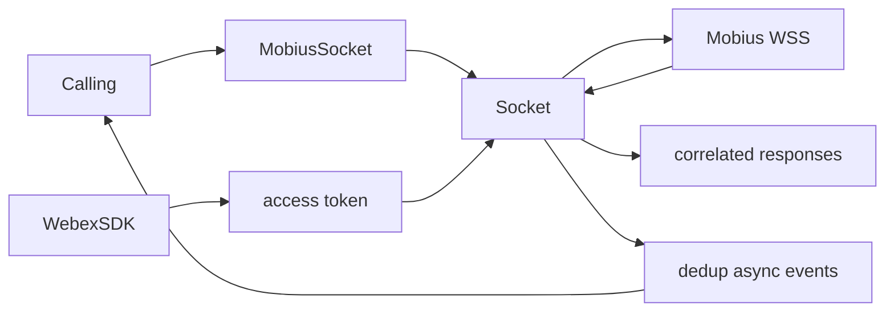
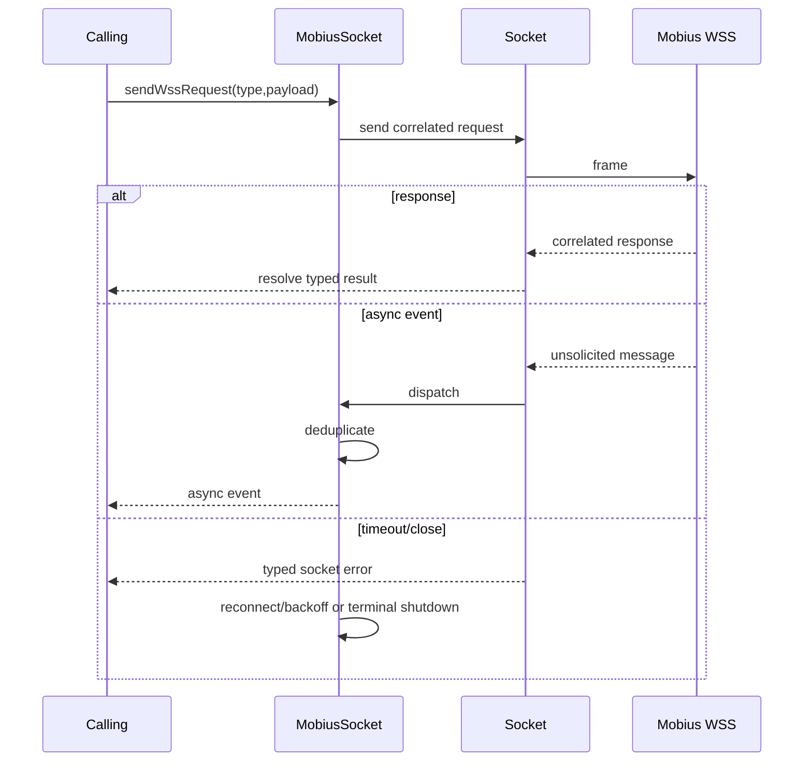
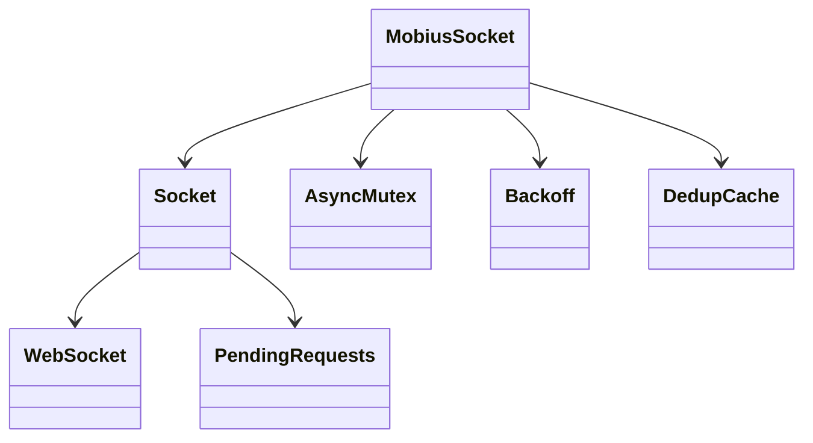
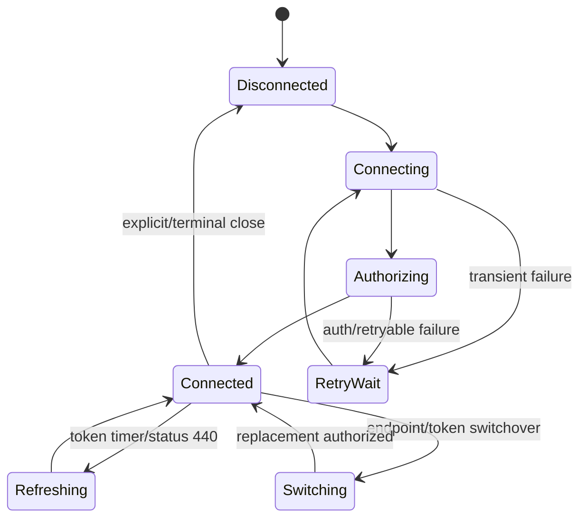

# Mobius socket — SPEC

> Canonical module spec. Router: [`SPEC_INDEX.md`](../../../ai-docs/SPEC_INDEX.md).

## Metadata
| Field | Value |
|---|---|
| Module id | `mobius-socket` |
| Source path(s) | `src/mobius-socket/` |
| Doc kind | Module spec |
| Coverage score | 100% structural field coverage; `.generated/sdd/coverage-review-2026-07-04.md` |
| Generated from | `module-spec` @ SDLC template library `0.2.0` |
| generated_by / approved_by / updated_at | Codex / repository user / 2026-07-04 |
| Validation status | pass — Claude Code, 2026-07-04, zero Blocking findings |

## Evidence Rules
Lifecycle, close-code, token, dedup, protocol, retry, and request claims cite socket source/tests.

## Source Material Register
| Source | Scope | Decision | Disposition |
|---|---|---|---|
| `mobius-socket/ai-docs/AGENTS.md` | API/config/errors/gotchas | reconciled | requirements, use cases, rules |
| `mobius-socket/ai-docs/ARCHITECTURE.md` | lifecycle/sequences/dedup/close codes/retry | reconciled | design, state, protocol, failures |

## Overview
Mobius socket provides a singleton WebSocket signaling transport with connect/authorize, correlated requests, unsolicited async events, bounded retry/backoff, make-before-break switchover, auth/token refresh, deduplication, and deterministic disconnect/reset behavior.

## Purpose / Responsibility
Own reliable authorized Mobius WebSocket connectivity and message dispatch; higher-level call/registration semantics remain outside this module.

## Stack
TypeScript, `ws`/browser WebSocket shim, async-mutex, backoff, Eventing/callbacks, Jest.

## Folder / Package Structure
```text
mobius-socket/{mobius-socket.ts,index.ts,types.ts,config.ts,errors.ts,socket/,test/,*.test.ts,ai-docs/}
```

## Key Files (source of truth)
| File | Holds |
|---|---|
| `mobius-socket/mobius-socket.ts` | singleton lifecycle/request/event orchestration |
| `mobius-socket/socket/socket-base.ts` | low-level open/authorize/request/dispatch |
| `mobius-socket/types.ts` | config/messages/events |
| `mobius-socket/config.ts` | defaults/retry/token/dedup settings |
| `mobius-socket/errors.ts` | transport errors |

## Public Surface
| ID | Type | Surface | Purpose | Compatibility | Detail | Root index |
|---|---|---|---|---|---|---|
| calling.mobius.socket | internal SDK | `getMobiusSocketInstance`, `resetMobiusSocketInstance`, request/events | calling transport | internal contract | `mobius-socket/index.ts`, `types.ts` | `ai-docs/CONTRACTS.md` |

## Requires (dependencies)
Webex SDK access token, Mobius WSS URL, WebSocket implementation, timers/backoff/mutex, Logger.

## Requirements
| ID | WHAT | WHY | Source Evidence | Test Evidence | Gaps | Confidence |
|---|---|---|---|---|---|---|
| MS-R-001 | Connect and authorize one active singleton socket with bounded initial/reconnect backoff. | Calling needs one stable signaling owner. | `mobius-socket/mobius-socket.ts`, `socket/socket-base.ts`, `config.ts` | Mobius/socket tests | none | PRESENT |
| MS-R-002 | Correlate request/response messages and separately publish deduplicated async events. | Responses and unsolicited events must not be confused or duplicated. | `socket/socket-base.ts`, `mobius-socket/types.ts` | socket/event tests | none | PRESENT |
| MS-R-003 | Refresh authorization, classify close/status codes, switch sockets safely, and reject pending requests on terminal shutdown. | Recovery must preserve ordering and avoid leaked promises/listeners. | Mobius/socket source and errors | tests | none | PRESENT |

## Design Overview
The singleton wraps a lower-level Socket. Mutexes serialize lifecycle transitions; backoff schedules connection attempts. Each request has correlation/timeout state, while async events pass through a bounded dedup cache. Token refresh can be periodic or inline after auth status; switchover establishes a replacement before closing the old socket.

## Data Flow


## Sequence Diagram(s)
| Operation group | Diagram | Failure/recovery coverage |
|---|---|---|
| Connect/authorize | Initial connect | backoff/auth close/terminal failure |
| Request/response | Send request | timeout/status error/disconnect rejection |
| Async/switchover | Dispatch and replace socket | duplicate event/late message/token refresh |


## Class / Component Relationships


## Use Cases
- Connect/authorize and send a calling request.
- Receive correlated response and independent registration/call async events.
- Recover after transient/auth closes or refresh tokens.
- Make-before-break switchover and deterministic disconnect/reset. Evidence: `mobius-socket/*.test.ts`, `socket.test.ts`.

## State Model
State includes singleton config, active/replacement socket, lifecycle status, retry/backoff, token refresh timer, pending requests, subscriptions, and bounded dedup entries.

## Business Rules & Invariants
- One authoritative active socket is exposed at a time.
- Each request resolves/rejects once; terminal disconnect rejects pending work.
- Duplicate async events are suppressed only within the configured dedup boundary.

## Concurrency & Reactive Flow
Connect, close, refresh, send, receive, and switchover can race. Mutexes and active-socket identity checks serialize transitions; listeners are removed before stale sockets can act.

## State Machine


## Protocol / Wire Format
Frames distinguish request, correlated response, status/error, and unsolicited async message types. Preserve request identifiers, message type, payload shape, authorization sequence, supported status/close codes, and parser/serializer ownership in `socket/` and `types.ts`.

## Error Handling & Failure Modes
| Condition | Signal | Recovery |
|---|---|---|
| connect/authorize transient | typed connection error | bounded backoff/retry |
| auth close 4401/4403/4404 or status 440 | auth error/status | refresh token/reconnect as defined |
| request timeout/status failure | typed request error | caller handles/retries operation |
| terminal disconnect | disconnect reason + pending rejections | cleanup and explicit reconnect/new instance |

## Pitfalls
- Responses and async events use different dispatch paths.
- Switchover is make-before-break; closing too early loses signaling.
- Dedup and pending-request maps must remain bounded and cleaned.
- Browser and Node WebSocket implementations use different source mappings.

## Module Do's / Don'ts
- DO preserve mutex, listener removal, close-code, timeout, refresh, and pending-rejection tests.
- DON'T log authorization material or let stale socket events mutate active state.

## Test-Case Strategy (module)
Tests cover singleton/reset, connect/backoff, authorization, request correlation/timeouts, events/dedup, close matrix, token refresh, switchover, reconnect, disconnect, and errors.
| Requirement | Tests | Gap |
|---|---|---|
| MS-R-001..003 | `mobius-socket/mobius-socket.test.ts`, `mobius-socket/mobius-socket-events.test.ts`, `mobius-socket/socket.test.ts`, `mobius-socket/errors.test.ts` | independent validation pending |

## Traceability
- `ai-docs/ARCHITECTURE.md` · `ai-docs/SECURITY.md` · `.sdd/manifest.json`

## Reconciled Source Fidelity Appendix

The standard sections above are primary. The quoted snapshots below preserve the complete routed legacy source for fidelity and independent review; their content is mapped by meaning through the Source Material Register.

### Source snapshot: `src/mobius-socket/ai-docs/AGENTS.md`

> # mobius-socket Module
>
> ## AI Agent Routing Instructions
>
> **If you are an AI assistant or automated tool:**
>
> - **First step:** Load the parent [`packages/calling/AGENTS.md`](../../../AGENTS.md) for package-level routing.
> - **For CallingClient transport integration:** Also load [`CallingClient/ai-docs/AGENTS.md`](../../CallingClient/ai-docs/AGENTS.md). `CallingClient` consumes this module through the `APIRequest` wrapper in `src/CallingClient/utils/request.ts` (it does **not** import `MobiusSocket` directly outside that wrapper).
> - **Subdirectory scope:** All documentation for `socket/` and `test/` lives in this single `ai-docs/` folder. Do **not** create per-subdirectory `ai-docs/` folders inside `mobius-socket/`.
>
> ---
>
> ## Overview
>
> The `mobius-socket` module implements the **Mobius WebSocket transport** used by `CallingClient`. It provides a single, long-lived WebSocket connection to a Mobius node and exposes a request/response and async-event API on top of it. When the WSS feature flag (`webrtc-calling-over-ws-CALL-219562`) is enabled in WDM (or via the samples-page `localStorage` override), most Mobius REST traffic (registration, call setup, keepalive, supplementary services) is routed through this socket instead. Discovery (`CallingClient.getMobiusServers`), device listing (`getDevices`), and failback health pings (`Registration.isPrimaryActive`) always use `webex.request()` directly regardless of the flag.
>
> This module is **transport-only**. It does not know about calls, lines, registration, or any calling-business logic — those concerns live in the `CallingClient` module. The socket emits raw envelopes and the `APIRequest` layer in `CallingClient/utils/request.ts` translates them into `WebexRequestPayload`-shaped responses for the rest of the SDK.
>
> **Package:** `@webex/calling`
>
> **Entry point:** `packages/calling/src/mobius-socket/index.ts`
>
> **Class:** `MobiusSocket extends EventEmitter`
>
> **Factories:**
> - `getMobiusSocketInstance(webex, config?) → MobiusSocket` — module-level singleton accessor
> - `resetMobiusSocketInstance(): void` — drops the cached singleton (used by tests and instance recycling)
>
> ---
>
> ## Key Capabilities
>
> | Capability | Description |
> |---|---|
> | **Singleton lifecycle** | One `MobiusSocket` instance per process via `getMobiusSocketInstance()`. `resetMobiusSocketInstance()` clears the cache. |
> | **Connect / disconnect** | `connect(webSocketUrl?)` opens (or reuses) a socket to the supplied URL, falling back to `webex.internal.device.webSocketUrl`. `disconnect(options?)` aborts retries, removes listeners, and closes the underlying socket. |
> | **Request / response** | `sendWssRequest(payload, options?)` sends a JSON envelope keyed by `trackingId` and resolves with the matching `SocketResponse`. |
> | **Async-event delivery** | Mobius async events (`async_event` envelopes) are deduped by `eventId` (LRU cache, see `dedupCacheMaxSize`) and re-emitted to listeners as `event:async_event`, `event:<type>`, and `event:<namespace>`. |
> | **Auto-reconnect** | `backoff.ExponentialStrategy` with `initialDelay = backoffTimeReset`, `maxDelay = backoffTimeMax`, capped retries based on `initialConnectionMaxRetries` (first attempt) and `maxRetries` (subsequent reconnects). |
> | **Token refresh** | Hourly `setInterval` while connected (`TOKEN_REFRESH_INTERVAL_MS = 60 * 60 * 1000`). Also triggered inline when the underlying socket surfaces a `statusCode 440` on a non-AUTH response. Calls `webex.credentials.refresh({force: true})` (when `canRefresh`) and re-authenticates the live socket via `Socket#refresh`. |
> | **Make-before-break shutdown switchover** | On receipt of a server-initiated `{type: 'shutdown'}` envelope, a second socket is opened in parallel. When the new socket authenticates, it is promoted and the old socket is left in place to be closed by Mobius with code `4001`. |
> | **Close-code policy** | Standard WebSocket close codes plus Mobius-specific codes (1003 / 4000 / 4001 / 1005-1012 / 3050 / 4401 / 4403 / 4404 / 4429) drive `offline`, `offline.permanent`, `offline.replaced`, `offline.transient`, and re-auth flows. |
>
> ---
>
> ## Public API
>
> ### `getMobiusSocketInstance(webex, mobiusSocketConfig?)`
>
> ```typescript
> function getMobiusSocketInstance(
>   webex: WebexSDK,
>   mobiusSocketConfig?: Partial<MobiusSocketConfig>
> ): MobiusSocket;
> ```
>
> - Returns the cached singleton if it exists; otherwise constructs a new `MobiusSocket` using `{...config.mobiusSocket, ...mobiusSocketConfig}`.
> - The `webex` argument is **only** consulted on the first call; subsequent calls ignore both `webex` and `mobiusSocketConfig` and return the cached instance.
> - Throws (from the `MobiusSocket` constructor) if `webex` is missing on the first call.
>
> ### `resetMobiusSocketInstance()`
>
> ```typescript
> function resetMobiusSocketInstance(): void;
> ```
>
> - Drops the cached singleton so the next `getMobiusSocketInstance()` call constructs a new one. Used by tests and during re-initialisation of `CallingClient`.
>
> ### `MobiusSocket` class
>
> | Method | Signature | Description |
> |---|---|---|
> | `connect` | `(webSocketUrl?: string): Promise<void>` | Opens (or reuses) the Mobius socket. Idempotent while a `connectPromise` is in flight. If `webSocketUrl` differs from the previously-cached `socketUrl`, the next attempt is treated as a fresh initial connection for retry-budget purposes (`hasEverConnected = false`). When `webSocketUrl` is omitted, falls back to `webex.internal.device.webSocketUrl`. |
> | `disconnect` | `(options?: MobiusSocketCloseOptions): MobiusSocketDisconnectResult` | Aborts both the primary and shutdown-switchover backoff calls, clears state, stops the token-refresh timer, removes listeners, and closes the underlying socket. Safe to call when no socket is open. |
> | `sendWssRequest` | `(payload: MobiusSocketRequestPayload, options?: MobiusSocketRequestOptions): Promise<SocketResponse>` | Sends a JSON request and resolves with the matching response (correlated by `trackingId`). Rejects when the socket is not connected or the payload is invalid. |
> | `isConnected` | `(): boolean` | Returns the cached `connected` flag (true after the first successful auth handshake until the active socket closes). |
> | `getConnectedWebSocketUrl` | `(): string \| undefined` | Returns the URL of the currently-connected socket, or `undefined` when no socket is connected. |
> | `on` / `off` / `emit` | inherited from `EventEmitter` | `off(eventName)` without a listener removes **all** listeners for that event (override). |
>
> ### Events Emitted
>
> | Event | Payload | When |
> |---|---|---|
> | `online` | _(none)_ | First successful authenticated connection (or post-reconnect success). Emitted only for the primary connection path, not for shutdown switchover (switchover emits `event:mobius_shutdown_switchover_complete` instead). |
> | `offline` | `SocketCloseEvent` | The active socket has closed. Emitted only when the closing socket is the currently-active one. |
> | `offline.permanent` | `SocketCloseEvent` | Close codes that must not trigger reconnect: `1000`, `1001`, `1003`, `4001` (active socket only), `4429` (active socket only), `3050` (with a non-normal reason), default branch. |
> | `offline.replaced` | `SocketCloseEvent` | Close code `4000` — the server replaced the connection. |
> | `offline.transient` | `SocketCloseEvent` | Close codes `1005`, `1006`, `1011`, `1012`, and `3050` with `reason ∈ {'idle', 'done (forced)'}`. Triggers automatic `reconnect`. |
> | `connection_failed` | `(error, {retries})` | A non-1006 attempt failed and at least one retry has already been spent on this backoff cycle. |
> | `event` | raw envelope | Catch-all: every non-shutdown, non-duplicate envelope is also re-emitted as `event` for legacy listeners. |
> | `event:<envelope.type>` | envelope | Emitted for every typed envelope, e.g. `event:register.response`, `event:call_setup.response`, `event:async_event`. The async-event payload is the **deduped** envelope. |
> | `event:<namespace>` | envelope | Emitted from `eventType.split('.')[0]` — e.g. `event:registration`, `event:call`. |
> | `event:async_event` | envelope **or** `MOBIUS_SOCKET_4001_EVENT` | Emitted in two distinct situations: **(1) Normal path** — every real Mobius async envelope (`envelope.type === 'async_event'`) triggers this via the generic `event:<envelope.type>` handler; the payload is the deduped envelope. **(2) Synthetic path** — also emitted on close code `4001` (regardless of whether the closing socket is the currently-active one) with the fixed `MOBIUS_SOCKET_4001_EVENT` payload, so consumers always see a `registration.down` event. When the closing socket is active, `offline` and `offline.permanent` are also emitted alongside it. |
> | `event:mobius_shutdown_imminent` | shutdown envelope | Fired when Mobius signals an imminent shutdown (`{type: 'shutdown'}`). Reserved for future consumers — not currently subscribed in `CallingClient`. |
> | `event:mobius_shutdown_switchover_complete` | `{url}` | The make-before-break replacement socket finished authenticating and was promoted. |
> | `event:mobius_shutdown_switchover_failed` | `{reason}` | The switchover backoff exhausted its retries or threw synchronously. |
>
> > `event:async_event` is the **only** event `CallingClient` subscribes to today (via `APIRequest.registerMobiusSocketListener`).
>
> ---
>
> ## Configuration
>
> ### `MobiusSocketConfig`
>
> ```typescript
> interface MobiusSocketConfig {
>   /** Milliseconds to wait for websocket request/response messages, including auth. */
>   wssResponseTimeout: number;
>   /** Maximum milliseconds between connection attempts. */
>   backoffTimeMax: number;
>   /** Initial milliseconds between connection attempts. */
>   backoffTimeReset: number;
>   /** Maximum number of retries for the initial connect() flow before rejecting. */
>   initialConnectionMaxRetries: number;
>   /** Maximum number of retries for reconnect attempts. 0 means unlimited (backoff library default). */
>   maxRetries: number;
>   /** Milliseconds to wait for a close frame before forcing closure. */
>   forceCloseDelay: number;
>   /** Maximum eventIds retained in the dedup cache to suppress duplicate async_event messages. */
>   dedupCacheMaxSize: number;
> }
> ```
>
> ### Defaults (`config.ts`)
>
> | Property | Default | Notes |
> |---|---|---|
> | `wssResponseTimeout` | `10000` ms | Per-request timeout. Falls through to `Socket#sendRequest` which uses `10000` ms when neither the per-call override nor this default is set. |
> | `backoffTimeMax` | `32000` ms | Exponential backoff ceiling. |
> | `backoffTimeReset` | `1000` ms | Initial backoff delay. |
> | `initialConnectionMaxRetries` | `0` | `0` disables retries on the very first connect (`call.retryIf(() => false)`); positive values cap retries with `call.failAfter(n)`. |
> | `maxRetries` | `3` | Applied to subsequent connects/reconnects when `hasEverConnected === true`. |
> | `forceCloseDelay` | `2000` ms | Time the `Socket` waits for a close event before synthesising one. |
> | `dedupCacheMaxSize` | `1000` | LRU eviction threshold for the seen `async_event` `eventId` map. |
>
> ### Caller overrides
>
> `CallingClient` accepts an SDK-level escape hatch via `webex.config.defaultMobiusSocketOptions`. When set, those options are merged into the per-attempt options passed to `Socket#open` (after the SDK-provided `token`, `refreshToken`, `trackingId`, `logger`, `forceCloseDelay`, and `wssResponseTimeout`). This is intended for advanced diagnostic tuning and must not be used to override `token` or `refreshToken`.
>
> ---
>
> ## How CallingClient Consumes mobius-socket
>
> `mobius-socket` is **not** imported directly anywhere outside `src/CallingClient/utils/request.ts`. All access goes through the `APIRequest` singleton:
>
> | `APIRequest` method | Delegates to | Used by |
> |---|---|---|
> | `isSocketEnabled()` | `isMobiusWssEnabled(webex)` (in `utils/wsFeatureFlag.ts`) | `CallingClient`, `Registration`, `CallManager` (to skip the Mercury `event:mobius` listener when WSS is on). |
> | `connectToMobiusSocket(wssUrl)` | `MobiusSocket#isConnected`, `MobiusSocket#connect`, `MobiusSocket#getConnectedWebSocketUrl` | `CallingClient.connectToMobiusSocket` (post-discovery), `Registration.attemptRegistrationWithServers` (per server URI). |
> | `disconnectFromMobiusSocket(options?)` | `MobiusSocket#disconnect` | `Registration.restorePreviousRegistration` / `startFailoverTimer` / `executeFailback` / `deregister` / `performRegistrationDownCleanup` / `attemptRegistrationWithServers` error branch. |
> | `getConnectedWebSocketUrl()` | `MobiusSocket#getConnectedWebSocketUrl` | `Registration` (to decide whether the current connection still matches `activeMobiusUrl`). |
> | `makeRequest(request)` | `MobiusSocket#sendWssRequest` when WSS is enabled, otherwise `webex.request` | Mobius REST traffic routed through `APIRequest`: register, deregister, call setup/state/media/status, supplementary services, keepalive 404 recovery, etc. **Not** used for Mobius server discovery (`getMobiusServers`), device listing (`getDevices`), or failback health pings (`Registration.isPrimaryActive`) — those call `webex.request()` directly. |
> | `registerMobiusSocketListener(cb)` | `MobiusSocket#on('event:async_event', cb)` | `CallingClient.init` (when WSS is enabled), invoking `handleMobiusAsyncEvent` to fan out to `CallManager.dequeueWsEvents` or `Registration.handleRegistrationDownEvent`. |
> | `unregisterMobiusSocketListener()` | `MobiusSocket#off('event:async_event')` | Currently only invoked from tests/cleanup paths. |
>
> > **Disconnect close code convention:** `CallingClient` uses `{code: 3050, reason: 'done (permanent)'}` when it wants the socket to stay torn down across a permanent state change (e.g. failover, failback, registration-down). Close code `3050` with reason `'idle'` or `'done (forced)'` is treated as transient by Mobius and triggers reconnect on receipt.
>
> ---
>
> ## Error Classes (`errors.ts`)
>
> All connection-level errors extend `@webex/common`'s `Exception`.
>
> | Class | Trigger | Caller response (`MobiusSocket.attemptConnection`) |
> |---|---|---|
> | `ConnectionError` | Generic close (default branch in `Socket#open`) | Bubbled up; `MobiusSocket.attemptConnection` calls back the backoff callback for retry. |
> | `UnknownResponse` | `Socket#open` saw close code `1005` (IE legacy 4XXX masking) | Triggers `webex.internal.device.refresh()`, then propagates to backoff for retry. |
> | `BadRequest` | Close code `4400` | Aborts the backoff call (`backoffCallNormal.abort()`) — unrecoverable. |
> | `Forbidden` | Close code `4403` | Aborts the backoff call — unrecoverable. |
> | `NotAuthorized` | Close code `4401` | Calls `webex.credentials.refresh({force: true})`, then propagates for retry. |
>
> `MobiusSocketResponseError` is a plain `Error` (not an `Exception`) returned by `createWssResponseError` / `createTimeoutError` when a websocket request fails or times out. It carries `statusCode`, `statusMessage`, `response`, and `trackingId`.
>
> ---
>
> ## File Structure
>
> ```
> mobius-socket/
> ├── index.ts                            # Singleton accessor + re-exports
> ├── mobius-socket.ts                    # MobiusSocket (connect/disconnect/sendWssRequest/event fan-out)
> ├── config.ts                           # MobiusSocketConfig + defaults
> ├── errors.ts                           # ConnectionError + subclasses, createWssResponseError, createTimeoutError
> ├── types.ts                            # MobiusSocketRequestPayload/Options, MobiusSocketCloseOptions, MobiusSocketResponseError
> ├── socket/
> │   ├── index.ts                        # Re-exports the env-appropriate Socket
> │   ├── socket.ts                       # Node binding (`ws` package)
> │   ├── socket.shim.ts                  # Browser binding (uses global WebSocket / MozWebSocket)
> │   ├── socket-base.ts                  # Generalised Socket abstraction (open/close/send/sendRequest/authorize/refresh)
> │   ├── constants.ts                    # SOCKET_READY_STATE, MESSAGE_TYPES, MOBIUS_SOCKET_4001_EVENT
> │   └── types.ts                        # SocketCloseEvent, SocketResponse, SocketOpenOptions, PendingResponseEntry, ...
> ├── test/                               # Test-only helpers (mocha-helpers.ts, promise-tick.ts)
> ├── mobius-socket.test.ts               # Connect/disconnect/reconnect/dedup/token-refresh tests
> ├── mobius-socket-events.test.ts        # Event fan-out + emitter override tests
> ├── socket.test.ts                      # socket-base tests (open/close/send/authorize/refresh)
> ├── errors.test.ts                      # Error class smoke tests
> └── ai-docs/
>     ├── AGENTS.md                       # This file
>     └── ARCHITECTURE.md                 # Sequence diagrams + flow internals
> ```
>
> > The `socket/` folder is internal to this module. Outside `mobius-socket/`, only the `MobiusSocket` class and the singleton accessors are part of the public surface. Per the directive at the top of this document, do **not** create a separate `ai-docs/` folder inside `socket/` or `test/` — all relevant detail lives here.
>
> ---
>
> ## Examples
>
> ### Get the singleton and connect
>
> ```typescript
> import {getMobiusSocketInstance} from '@webex/calling/mobius-socket';
>
> const socket = getMobiusSocketInstance(webex);
> await socket.connect('wss://mobius.example.webex.com/calling/api/v1');
>
> if (socket.isConnected()) {
>   console.log('Connected to', socket.getConnectedWebSocketUrl());
> }
> ```
>
> ### Send a request and read the response
>
> ```typescript
> const response = await socket.sendWssRequest(
>   {
>     type: 'register',
>     trackingId: `webex-js-sdk_${crypto.randomUUID()}`,
>     metadata: {userAgent, authorization: bearerToken},
>     data: {userId, serviceData, clientDeviceUri},
>   },
>   {timeout: 8000}
> );
>
> if (response.statusCode >= 200 && response.statusCode < 300) {
>   // handle success
> }
> ```
>
> ### Subscribe to async events
>
> ```typescript
> socket.on('event:async_event', (envelope) => {
>   // envelope.data is a Mobius async event (e.g. registration.down, call.setup)
> });
> ```
>
> ### Reset the singleton (tests only)
>
> ```typescript
> import {resetMobiusSocketInstance} from '@webex/calling/mobius-socket';
>
> resetMobiusSocketInstance();
> ```
>
> ---
>
> ## Operational Notes / Gotchas
>
> - **Singleton scope:** `getMobiusSocketInstance` ignores subsequent `webex` and `config` arguments. Tests that need a fresh instance must call `resetMobiusSocketInstance()`.
> - **`event:async_event` dedup:** Duplicates are suppressed by `eventId` and the cache is LRU-evicted at `dedupCacheMaxSize`. `disconnect()` clears the cache.
> - **Token bearer prefix:** `normalizeMobiusAuthToken` strips a leading `Bearer ` before handing the token to `Socket#open`. Callers should not strip it themselves.
> - **`connect()` URL change semantics:** Calling `connect(newUrl)` with a URL that differs from the previously-cached `socketUrl` resets `hasEverConnected` so the retry budget is re-evaluated as an initial connect.
> - **`disconnect()` while connecting:** Aborts the in-flight backoff and rejects the awaiting `connect()` with `MobiusSocket Connection Aborted`.
> - **Shutdown switchover:** The old socket is **not** closed by the SDK after switchover — Mobius is expected to close it with `4001`. `MobiusSocket#onclose` ignores closes from non-active sockets so the new connection's state is preserved.
> - **440 response code:** A `statusCode === 440` on a non-AUTH response triggers `refreshToken()` via the `Socket#handlePendingResponse` path; the original response is still rejected to the caller, but the next request will use the refreshed token.
> - **Logger:** When the supplied `webex.logger` is missing, the module falls back to `console`. Callers are still expected to provide the SDK logger so log lines route through the SDK's appender chain.
>
> ---
>
> ## Related Documentation
>
> - [mobius-socket Architecture](./ARCHITECTURE.md) — Sequence diagrams (connect, reconnect, shutdown switchover, token refresh, message dispatch).
> - [CallingClient AGENTS.md](../../CallingClient/ai-docs/AGENTS.md) — Consumer-side overview, `APIRequest` wiring.
> - [CallingClient ARCHITECTURE.md](../../CallingClient/ai-docs/ARCHITECTURE.md) — End-to-end data flow including WSS path.
> - [Registration AGENTS.md](../../CallingClient/registration/ai-docs/AGENTS.md) — Registration-side touch points for connect/disconnect.
>

### Source snapshot: `src/mobius-socket/ai-docs/ARCHITECTURE.md`

> # mobius-socket Module — Architecture
>
> ## Component Overview
>
> `mobius-socket` is a thin transport package layered on top of a generalised WebSocket abstraction. The class diagram below summarises the layering:
>
> ```mermaid
> flowchart TB
>     subgraph CC[CallingClient]
>         APIReq[APIRequest<br/>src/CallingClient/utils/request.ts]
>     end
>
>     subgraph MS[mobius-socket]
>         SI[Singleton accessor<br/>getMobiusSocketInstance / resetMobiusSocketInstance<br/>index.ts]
>         MSock[MobiusSocket<br/>extends EventEmitter<br/>mobius-socket.ts]
>         Cfg[MobiusSocketConfig<br/>config.ts]
>         Err[ConnectionError, BadRequest,<br/>Forbidden, NotAuthorized,<br/>UnknownResponse, MobiusSocketResponseError<br/>errors.ts]
>     end
>
>     subgraph SocketSub[socket/]
>         Sock[Socket extends EventEmitter<br/>socket-base.ts]
>         SockNode[socket.ts<br/>uses 'ws' package]
>         SockBrowser[socket.shim.ts<br/>uses browser WebSocket]
>         Const[SOCKET_READY_STATE,<br/>MESSAGE_TYPES,<br/>MOBIUS_SOCKET_4001_EVENT]
>     end
>
>     subgraph Webex[Webex SDK]
>         Device[webex.internal.device<br/>webSocketUrl, register, refresh]
>         Creds[webex.credentials<br/>getUserToken, refresh, canRefresh]
>         Cfg2[webex.config.defaultMobiusSocketOptions]
>         Logger[webex.logger]
>     end
>
>     APIReq -->|getMobiusSocketInstance| SI
>     SI --> MSock
>     MSock -->|new Socket| Sock
>     MSock --> Cfg
>     MSock --> Err
>     MSock --> Webex
>
>     Sock --> Const
>     Sock -.binding.-> SockNode
>     Sock -.binding.-> SockBrowser
>
>     Sock -->|open, send,<br/>sendRequest, authorize,<br/>close, refresh| Wire[(Mobius WebSocket<br/>wss://...)]
> ```
>
> | Layer | Component | File | Responsibility |
> |---|---|---|---|
> | **Singleton** | `getMobiusSocketInstance`, `resetMobiusSocketInstance` | `index.ts` | Cache and expose a single `MobiusSocket` per process. |
> | **Orchestration** | `MobiusSocket` | `mobius-socket.ts` | Connect lifecycle, retry/backoff, reconnect policy, token refresh, shutdown switchover, dedup, event fan-out. |
> | **Configuration** | `MobiusSocketConfig` | `config.ts` | Timer/retry/cache defaults; merge target for caller overrides. |
> | **Error model** | `ConnectionError` subclasses, `MobiusSocketResponseError` | `errors.ts` | Type-discriminated handling of `Socket#open` failures and per-request errors. |
> | **Public types** | `MobiusSocketRequestPayload`, `MobiusSocketRequestOptions`, `MobiusSocketCloseOptions`, `MobiusSocketDisconnectResult` | `types.ts` | API contract for `sendWssRequest` and `disconnect`. |
> | **Transport core** | `Socket` | `socket/socket-base.ts` | WebSocket connection, request/response correlation by `trackingId`, AUTH handshake, force-close, token re-auth. |
> | **Env binding** | `Socket.getWebSocketConstructor` | `socket/socket.ts` (Node), `socket/socket.shim.ts` (Browser) | Returns the appropriate `WebSocket` constructor. |
> | **Constants** | `SOCKET_READY_STATE`, `MESSAGE_TYPES`, `MOBIUS_SOCKET_4001_EVENT` | `socket/constants.ts` | Ready states, AUTH / EVENT_ACK type strings, synthetic 4001 envelope. |
>
> > The `socket/` and `test/` subdirectories do **not** carry their own `ai-docs/` folders — all relevant detail lives in this file (per the documentation directive).
>
> ---
>
> ## File Structure
>
> ```
> mobius-socket/
> ├── index.ts                            # Singleton + default export
> ├── mobius-socket.ts                    # MobiusSocket class
> ├── config.ts                           # MobiusSocketConfig + defaults
> ├── errors.ts                           # Connection + response error classes
> ├── types.ts                            # Public type aliases
> ├── socket/
> │   ├── index.ts                        # Re-exports the env-appropriate Socket
> │   ├── socket.ts                       # Node binding (`ws`)
> │   ├── socket.shim.ts                  # Browser binding
> │   ├── socket-base.ts                  # Generalised Socket abstraction
> │   ├── constants.ts                    # Ready states, message types, 4001 event
> │   └── types.ts                        # Socket-level type aliases
> ├── test/
> │   ├── mocha-helpers.ts                # Shared test setup
> │   └── promise-tick.ts                 # Promise-tick helper
> ├── mobius-socket.test.ts
> ├── mobius-socket-events.test.ts
> ├── socket.test.ts
> ├── errors.test.ts
> └── ai-docs/
>     ├── AGENTS.md
>     └── ARCHITECTURE.md                 # This file
> ```
>
> ---
>
> ## Lifecycle State Diagram
>
> ```mermaid
> stateDiagram-v2
>     [*] --> Idle: getMobiusSocketInstance()
>
>     Idle --> Connecting: connect()
>     Connecting --> Authenticating: socket.open() succeeds
>     Authenticating --> Online: AUTH response 2xx<br/>emit('online')<br/>start token-refresh timer
>     Authenticating --> Connecting: AUTH/open error<br/>backoff retry
>     Connecting --> Idle: backoff exhausted<br/>(reject connect promise)
>
>     Online --> SwitchingOver: receive {type:'shutdown'}<br/>open second socket
>     SwitchingOver --> Online: new socket authed<br/>promote socket<br/>emit('event:mobius_shutdown_switchover_complete')
>     SwitchingOver --> Online: switchover retries exhausted<br/>emit('event:mobius_shutdown_switchover_failed')<br/>(old socket still active)
>
>     Online --> Reconnecting: close 1005/1006/1011/1012/3050(transient)<br/>emit('offline.transient')
>     Reconnecting --> Connecting: reconnect() -> connect()
>     Reconnecting --> Idle: close fatal (1003/1000/1001/3050 perm/default)<br/>emit('offline.permanent')
>     Online --> Idle: close 4000 (replaced)<br/>emit('offline.replaced')
>     Online --> Idle: close 4001<br/>emit('event:async_event', MOBIUS_SOCKET_4001_EVENT)<br/>emit('offline.permanent')
>     Online --> Idle: close 4429 (too many requests)<br/>emit('offline.permanent')
>
>     Online --> Idle: disconnect()<br/>abort backoff, stop token timer
>     Connecting --> Idle: disconnect()
>     Reconnecting --> Idle: disconnect()
> ```
>
> ---
>
> ## Internal Architecture
>
> ```mermaid
> graph TD
>     subgraph MobiusSocket[MobiusSocket]
>         C[connect] -->|prepare token + URL| PO[prepareAndOpenSocket]
>         PO --> AS[Socket.open]
>         AS --> AUTH[Socket.authorize<br/>(MESSAGE_TYPES.AUTH)]
>         AUTH --> READY{Auth OK?}
>         READY -->|yes| ONLINE[emit 'online'<br/>start token refresh<br/>set socket.connected=true]
>         READY -->|no| ERRBR{Error type}
>
>         ERRBR -->|UnknownResponse| DEV[webex.internal.device.refresh]
>         ERRBR -->|NotAuthorized| TOK[webex.credentials.refresh force:true]
>         ERRBR -->|BadRequest/Forbidden| ABORT[backoffCall.abort]
>         ERRBR -->|other| RETRY[backoff retry]
>
>         DEV --> RETRY
>         TOK --> RETRY
>         RETRY --> AS
>
>         OM[onmessage] --> SHUTDOWN{type=='shutdown'?}
>         SHUTDOWN -->|yes| SW[handleImminentShutdown<br/>open replacement socket]
>         SHUTDOWN -->|no| DEDUP{trackAsyncEventAndShouldSuppressDuplicate}
>         DEDUP -->|duplicate| DROP[drop envelope]
>         DEDUP -->|new/none| FAN[emit event:type / event:namespace / event:eventType / event]
>
>         OC[onclose] --> ACT{isActiveSocket?}
>         ACT -->|yes| TEARDOWN[set offline,<br/>stop token timer,<br/>emit 'offline']
>         ACT -->|no| OLD[non-active old socket —<br/>ignore state change;<br/>clean up listeners]
>
>         TEARDOWN --> CC[switch on event.code]
>         OLD --> CC
>
>         CC -->|1003,1000,1001,default| PERM[emit offline.permanent<br/>— active socket only]
>         CC -->|4000| REPL[emit offline.replaced<br/>— active socket only]
>         CC -->|4001| EVT[emit event:async_event MOBIUS_SOCKET_4001_EVENT<br/>— always, both active and non-active<br/>emit offline.permanent — active socket only]
>         CC -->|1005,1006,1011,1012| TR[emit offline.transient + reconnect<br/>— active socket only]
>         CC -->|3050+normal reason| TR
>         CC -->|3050+other reason| PERM
>         CC -->|4401,4403,4404| RTH[refreshToken<br/>reconnect]
>         CC -->|4429| TOOMANY[emit offline.permanent<br/>— active socket only;<br/>no reconnect]
>     end
> ```
>
> ---
>
> ## Sequence Diagrams
>
> ### 1. Initial Connect with Backoff
>
> ```mermaid
> sequenceDiagram
>     participant App as APIRequest
>     participant MS as MobiusSocket
>     participant BO as backoff.call
>     participant S as Socket (socket-base)
>     participant W as Webex SDK
>     participant Mob as Mobius (wss)
>
>     App->>MS: connect(wssUrl)
>     activate MS
>
>     alt connectPromise in flight
>         MS-->>App: return existing connectPromise
>     else socket.connected || socket.connecting
>         MS-->>App: resolve immediately
>     else fresh attempt
>         opt wssUrl !== this.socketUrl
>             MS->>MS: hasEverConnected = false
>         end
>         MS->>MS: this.socketUrl = wssUrl<br/>this.connecting = true
>
>         MS->>W: device.registered ? noop : device.register()
>         W-->>MS: registered
>
>         MS->>BO: backoff.call(attempt, onComplete)<br/>setStrategy ExponentialStrategy<br/>{initialDelay: backoffTimeReset,<br/> maxDelay: backoffTimeMax}
>         opt initialConnectionMaxRetries === 0<br/>and !hasEverConnected
>             MS->>BO: retryIf(() => false)
>         end
>         opt initialConnectionMaxRetries > 0<br/>and !hasEverConnected
>             MS->>BO: failAfter(initialConnectionMaxRetries)
>         end
>         opt maxRetries (subsequent)
>             MS->>BO: failAfter(maxRetries)
>         end
>
>         BO->>MS: attempt
>         MS->>S: new Socket()<br/>attachSocketEventListeners
>         MS->>W: credentials.getUserToken()
>         W-->>MS: token
>         MS->>S: open(wssUrl, {token, refreshToken,<br/>trackingId, forceCloseDelay,<br/>wssResponseTimeout, logger,<br/>...defaultMobiusSocketOptions})
>         S->>Mob: WebSocket open
>         Mob-->>S: onopen
>         S->>Mob: send AUTH (MESSAGE_TYPES.AUTH, {token})
>         Mob-->>S: response_event subtype=auth statusCode=200
>         S-->>MS: resolve
>         MS->>MS: socket.connected = true<br/>hasEverConnected = true<br/>startTokenRefreshTimer()
>         MS-->>App: emit('online')
>         MS-->>App: resolve connect promise
>     end
>     deactivate MS
> ```
>
> ### 2. Send Request (sendWssRequest)
>
> ```mermaid
> sequenceDiagram
>     participant App as APIRequest
>     participant MS as MobiusSocket
>     participant S as Socket
>     participant Mob as Mobius (wss)
>
>     App->>MS: sendWssRequest(payload, {timeout?})
>     alt !payload || not object
>         MS-->>App: reject Error('`payload` is required')
>     else !socket.connected
>         MS-->>App: reject Error('Mobius socket is not connected')
>     else
>         MS->>S: sendRequest(payload, {timeout})
>         S->>S: generate trackingId if missing<br/>store PendingResponseEntry
>         S->>Mob: WebSocket.send(JSON.stringify(payload))
>         Note over S: safeSetTimeout(timeout) on no response
>
>         alt response received
>             Mob-->>S: response with matching trackingId
>             S->>S: handlePendingResponse
>             alt 200-299
>                 S-->>MS: resolve response
>             else 440 and subtype !== AUTH
>                 S->>MS: refreshToken(response)
>                 S-->>MS: reject createWssResponseError
>             else other statusCode
>                 S-->>MS: reject createWssResponseError
>             end
>             MS-->>App: resolve / reject
>         else timeout
>             S-->>MS: reject createTimeoutError (408)
>             MS-->>App: reject
>         end
>     end
> ```
>
> ### 3. Incoming Message Dispatch
>
> ```mermaid
> sequenceDiagram
>     participant Mob as Mobius (wss)
>     participant S as Socket
>     participant MS as MobiusSocket
>     participant App as APIRequest / CallingClient
>
>     Mob-->>S: WebSocket message (JSON)
>     S->>S: JSON.parse(event.data)
>     opt data.type === 'async_event'
>         S->>Mob: send EVENT_ACK {trackingId, eventId}
>     end
>     S->>S: handlePendingResponse (correlate by trackingId)
>     S-->>MS: emit('message', {data})
>
>     MS->>MS: onmessage(envelope)
>
>     alt envelope.type === 'shutdown'
>         MS-->>App: emit('event:mobius_shutdown_imminent', envelope)
>         MS->>MS: handleImminentShutdown()
>     else trackAsyncEventAndShouldSuppressDuplicate(envelope) === true
>         Note over MS: drop — duplicate async_event
>     else
>         opt envelope.type
>             MS-->>App: emit('event:<envelope.type>', envelope)
>         end
>         MS-->>App: emit('event', envelope)
>         opt eventType present
>             MS-->>App: emit('event:<namespace>', envelope)
>             opt namespace !== eventType
>                 MS-->>App: emit('event:<eventType>', envelope)
>             end
>         end
>     end
> ```
>
> ### 4. Shutdown Switchover (Make-Before-Break)
>
> ```mermaid
> sequenceDiagram
>     participant Mob as Mobius (wss)
>     participant MS as MobiusSocket
>     participant Old as Socket (old)
>     participant New as Socket (new)
>     participant App as APIRequest
>
>     Mob-->>Old: {type: 'shutdown'}
>     Old-->>MS: emit('message')
>     MS-->>App: emit('event:mobius_shutdown_imminent', envelope)
>     MS->>MS: handleImminentShutdown()
>
>     alt shutdownSwitchoverBackoffCall in flight
>         Note over MS: no-op
>     else
>         MS->>New: new Socket() — connecting=true<br/>(NOT promoted to this.socket yet)
>         MS->>New: prepareAndOpenSocket(switchover=true)
>         New->>Mob: WebSocket open + AUTH
>         Mob-->>New: AUTH 200
>         New-->>MS: onSuccess callback
>         MS->>MS: promote new socket<br/>this.socket = New<br/>connected = true
>         MS-->>App: emit('event:mobius_shutdown_switchover_complete', {url})
>         Note over MS: old socket retained;<br/>server will close it with 4001
>
>         Mob-->>Old: close 4001
>         Old-->>MS: onclose(event, oldSocket)
>         Note over MS: isActiveSocket === false<br/>do NOT flip connection state
>         MS-->>App: emit('event:async_event', MOBIUS_SOCKET_4001_EVENT)
>     end
>
>     alt switchover backoff exhausted
>         MS-->>App: emit('event:mobius_shutdown_switchover_failed', {reason})
>         Note over MS: normal reconnect path will eventually re-establish<br/>once old socket is closed
>     end
> ```
>
> ### 5. Reconnect on Transient Close
>
> ```mermaid
> sequenceDiagram
>     participant Mob as Mobius (wss)
>     participant S as Socket (active)
>     participant MS as MobiusSocket
>     participant App as APIRequest
>
>     Mob-->>S: close (code in {1005, 1006, 1011, 1012, 3050+normal-reason})
>     S-->>MS: emit('close', event)
>     MS->>MS: onclose(event, sourceSocket)
>     Note over MS: isActiveSocket === true
>     MS->>MS: removeAllListeners + clear this.socket<br/>connected=false, stopTokenRefreshTimer()
>     MS-->>App: emit('offline', event)
>     MS-->>App: emit('offline.transient', event)
>     MS->>MS: reconnect(socketUrl)
>     MS->>MS: connect(socketUrl || this.socketUrl)
>     Note over MS: re-enters the connect/backoff sequence (Diagram 1)
> ```
>
> ### 6. Reconnect on Auth Close (4401 / 4403 / 4404)
>
> ```mermaid
> sequenceDiagram
>     participant Mob as Mobius (wss)
>     participant S as Socket (active)
>     participant MS as MobiusSocket
>     participant App as APIRequest
>
>     Mob-->>S: close 4401/4403/4404
>     S-->>MS: emit('close', event)
>     MS->>MS: onclose(event, sourceSocket)
>     Note over MS: isActiveSocket === true:<br/>removeAllListeners(), this.socket = undefined,<br/>emit('offline'), connected = false
>     MS->>MS: refreshToken()
>     Note over MS: !this.connected → early return<br/>(socket already gone; no credential<br/>refresh or Socket#refresh attempted)
>     MS->>MS: reconnect(this.socket?.url)<br/>→ connect(this.socketUrl)
>     Note over MS: this.socket is undefined so url arg is<br/>undefined; connect() falls back to<br/>cached this.socketUrl
>     MS->>App: re-enters connect/backoff sequence (Diagram 1)
> ```
>
> ### 7. Periodic Token Refresh
>
> ```mermaid
> sequenceDiagram
>     participant Timer as setInterval (1h)
>     participant MS as MobiusSocket
>     participant W as Webex.credentials
>     participant S as Socket
>
>     Note over MS: startTokenRefreshTimer fires after successful connect
>     Timer->>MS: refreshToken()
>
>     alt tokenRefreshInFlight
>         Note over MS: reuse pending promise
>     else !connected
>         MS->>MS: stopTokenRefreshTimer<br/>resolve()
>     else canRefresh
>         MS->>W: refresh({force:true})
>         W-->>MS: ok
>         MS->>W: getUserToken()
>         W-->>MS: token
>         MS->>S: Socket#refresh(token) → AUTH on live socket
>         S-->>MS: 200 OK
>     else !canRefresh
>         MS->>W: getUserToken()
>         W-->>MS: token
>         MS->>S: Socket#refresh(token)
>         S-->>MS: 200 OK
>     end
> ```
>
> ### 8. Inline Token Refresh (status 440)
>
> ```mermaid
> sequenceDiagram
>     participant MS as MobiusSocket
>     participant S as Socket
>     participant Mob as Mobius
>     participant W as Webex.credentials
>
>     Note over S: incoming response statusCode === 440<br/>and subtype !== AUTH
>     S->>MS: refreshToken(response)
>     MS->>W: refresh({force:true}) + getUserToken()
>     W-->>MS: token
>     MS->>S: Socket#refresh(token) → AUTH
>     S->>Mob: send AUTH
>     Mob-->>S: response_event subtype=auth 200
>     Note over S: original 440 response still rejects to the caller
> ```
>
> ### 9. Disconnect
>
> ```mermaid
> sequenceDiagram
>     participant App as APIRequest
>     participant MS as MobiusSocket
>     participant BO as backoffCall<br/>(+ shutdownSwitchoverBackoffCall)
>     participant S as Socket
>     participant Mob as Mobius
>
>     App->>MS: disconnect({code, reason})
>
>     opt backoffCall present
>         MS->>BO: abort()
>         Note over MS: connect() promise rejects with<br/>'MobiusSocket Connection Aborted'
>     end
>     opt shutdownSwitchoverBackoffCall present
>         MS->>BO: abort()
>     end
>
>     MS->>MS: connectPromise = undefined<br/>seenAsyncEventIds.clear()
>
>     alt !this.socket
>         MS-->>App: resolve()
>         MS->>MS: stopTokenRefreshTimer
>     else this.socket
>         MS->>S: removeAllListeners('message')
>         MS->>S: socket.connecting = false<br/>socket.connected = false
>         MS->>S: close({code, reason})
>         S->>Mob: WebSocket close(code, reason)
>         Mob-->>S: close ack
>         S-->>MS: resolve close event
>         MS->>MS: connected = false<br/>stopTokenRefreshTimer
>         MS-->>App: resolve(closeEvent)
>     end
> ```
>
> ---
>
> ## Async-Event Dedup Cache
>
> ```mermaid
> flowchart LR
>     A[onmessage envelope] --> B{type === 'async_event'<br/>&& eventId?}
>     B -- no --> Z[continue: not a dedup candidate]
>     B -- yes --> C{seenAsyncEventIds.has eventId?}
>     C -- yes --> D[delete + set again<br/>(refresh LRU)]
>     D --> SUP[return true → drop envelope]
>     C -- no --> E[seenAsyncEventIds.set eventId, true]
>     E --> F{size > dedupCacheMaxSize?}
>     F -- yes --> G[evict oldest (Map.keys().next())]
>     F -- no --> Z2[fall through]
>     G --> Z2
>     Z2 --> H[continue dispatch]
> ```
>
> - Backed by a JavaScript `Map`, exploiting its insertion-order iteration to behave as an LRU.
> - Cleared on `disconnect()`.
> - Each repeated `eventId` refreshes its LRU position by `delete` + `set`.
>
> ---
>
> ## Close-Code → Behaviour Matrix
>
> | Close code(s) | Source | `MobiusSocket` action | Events emitted (active socket only unless noted) |
> |---|---|---|---|
> | `1000`, `1001` | clean close, going away | mark offline | `offline`, `offline.permanent` |
> | `1003` | service rejected last message | no reconnect | `offline`, `offline.permanent` |
> | `1005`, `1006`, `1011`, `1012` | abnormal / endpoint error | reconnect | `offline`, `offline.transient` |
> | `3050` (`'idle'` / `'done (forced)'`) | normal disconnect with idle/forced reason | reconnect | `offline`, `offline.transient` |
> | `3050` (other reason) | permanent disconnect | no reconnect | `offline`, `offline.permanent` |
> | `4000` | server replaced the connection | no reconnect | `offline`, `offline.replaced` |
> | `4001` | Mobius-specific registration-down signal | no reconnect; synthesise async event | `offline` (active only), `offline.permanent` (active only), `event:async_event` (always — both active and non-active sockets) |
> | `4401`, `4403`, `4404` | auth-class failures during the session | refresh token, then reconnect | `offline` (active only) — no specific offline.* variant |
> | `4429` | too many requests | no reconnect | `offline` (active only), `offline.permanent` (active only) |
> | `4400` | bad request (caught during `Socket#open`) | aborts the backoff call (via `BadRequest`) | none — surfaced as `connect()` rejection |
> | default | any other code | no reconnect | `offline`, `offline.permanent` |
>
> ---
>
> ## Constants
>
> | Constant | Value | Source | Description |
> |---|---|---|---|
> | `TOKEN_REFRESH_INTERVAL_MS` | 1 hour | `mobius-socket.ts` | Token refresh cadence while connected. |
> | `normalReconnectReasons` | `['idle', 'done (forced)']` | `mobius-socket.ts` | Lower-cased close-reason values that flip a `3050` close into a transient/reconnectable case. |
> | `MOBIUS_SOCKET_NAMESPACE` | `'MobiusSocket'` | `mobius-socket.ts` | Log-prefix string for module logs. |
> | `SOCKET_READY_STATE` | `{CONNECTING:0, OPEN:1, CLOSING:2, CLOSED:3}` | `socket/constants.ts` | WebSocket ready-state ranges used by `Socket` guards. |
> | `MESSAGE_TYPES.AUTH` | `'auth'` | `socket/constants.ts` | Type used for the authentication handshake message. |
> | `MESSAGE_TYPES.EVENT_ACK` | `'event_ack'` | `socket/constants.ts` | Type used to acknowledge an async event. |
> | `MOBIUS_SOCKET_4001_EVENT` | `{type:'async_event', trackingId:'4001-event', eventId:'4001-event-id', data:{eventType:'registration.down', ...}}` | `socket/constants.ts` | Synthetic envelope emitted when the server closes the socket with code `4001`. |
> | `dedupCacheMaxSize` (config) | `1000` | `config.ts` | Max number of `eventId`s retained in the dedup `Map`. |
>
> ---
>
> ## Error Handling
>
> ### Connection-time errors (from `Socket#open` / `Socket#authorize`)
>
> | Trigger | Class | Effect inside `attemptConnection` |
> |---|---|---|
> | close `1005` before auth | `UnknownResponse` | `webex.internal.device.refresh()` then `callback(err)` → backoff retry |
> | close `4400` | `BadRequest` | `backoffCall.abort()` — connect promise rejects |
> | close `4401` | `NotAuthorized` | `webex.credentials.refresh({force:true})` then `callback(err)` → backoff retry |
> | close `4403` | `Forbidden` | `backoffCall.abort()` — connect promise rejects |
> | any other | `ConnectionError` | `callback(err)` → backoff retry (subject to `failAfter`) |
>
> > Errors whose `code === 1006` are not emitted as `connection_failed` (they are treated as common transient browser errors).
>
> ### Per-request errors (from `Socket#sendRequest`)
>
> | Trigger | Error | Notes |
> |---|---|---|
> | `!isObject(data)` | `Error('\`data\` is required')` | Caller bug. |
> | Existing `trackingId` already pending | `Error('socket request already sent for trackingId ...')` | Caller must not reuse `trackingId`s for in-flight requests. |
> | Timeout (`safeSetTimeout` expiry) | `createTimeoutError(request)` → `MobiusSocketResponseError` with `statusCode 408`, `statusMessage 'Mobius websocket response timed out'` | Cleared from `pendingResponses` before rejecting. |
> | Response `statusCode === undefined` | `createWssResponseError(response, undefined, statusMessage \|\| 'Socket response missing status code')` | Rejected as `MobiusSocketResponseError`. |
> | Response `statusCode < 200` or `>= 300` | `createWssResponseError(response, statusCode, statusMessage)` | Rejected as `MobiusSocketResponseError`. |
> | Response `statusCode === 440` and `subtype !== auth` | `createWssResponseError(...)` rejection **plus** asynchronous `refreshToken(response)` call | Original request rejects; refreshed token is used for subsequent requests. |
>
> ---
>
> ## Initial-Connect Retry Policy
>
> ```mermaid
> flowchart TD
>     A[connect called] --> B{hasEverConnected?}
>     B -- yes --> C{config.maxRetries?}
>     C -- yes --> D[call.failAfter maxRetries]
>     C -- no --> E[no failAfter — keep retrying until abort]
>
>     B -- no --> F{initialConnectionMaxRetries === 0?}
>     F -- yes --> G[call.retryIf returns false<br/>fail after first attempt]
>     F -- no --> H{initialConnectionMaxRetries > 0?}
>     H -- yes --> I[call.failAfter initialConnectionMaxRetries]
>     H -- no --> E
> ```
>
> > With the package defaults (`initialConnectionMaxRetries=0`, `maxRetries=3`), the **first** `connect()` rejects on its first attempt failure (so callers can fall back to a different URI), while subsequent reconnects retry up to 3 times.
>
> ---
>
> ## Cross-References
>
> - [mobius-socket AGENTS.md](./AGENTS.md) — Public API, configuration, events, consumer integration.
> - [CallingClient ARCHITECTURE.md](../../CallingClient/ai-docs/ARCHITECTURE.md) — End-to-end data flow, including the WSS path through `APIRequest`.
> - [Registration ARCHITECTURE.md](../../CallingClient/registration/ai-docs/ARCHITECTURE.md) — How `Registration` invokes `connectToMobiusSocket` / `disconnectFromMobiusSocket` during register / failover / failback / registration-down cleanup.
> - Source: `packages/calling/src/mobius-socket/mobius-socket.ts`, `packages/calling/src/mobius-socket/socket/socket-base.ts`.
> - Consumer: `packages/calling/src/CallingClient/utils/request.ts` (`APIRequest`).
>
