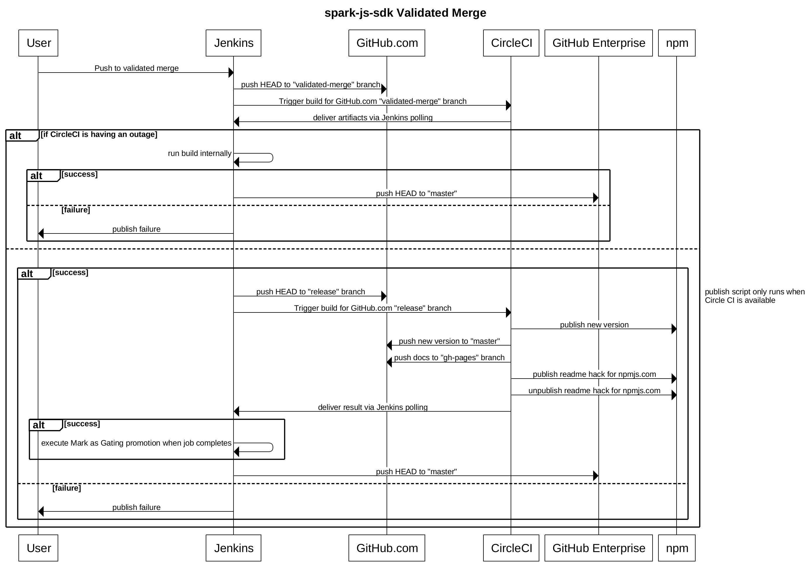
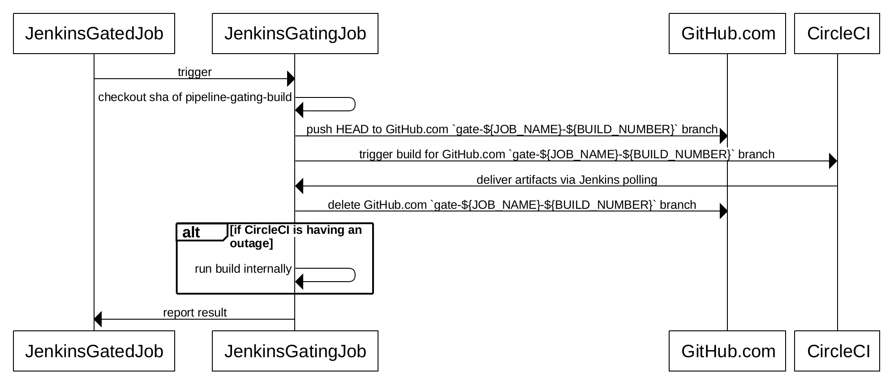

# Tooling

## Validated Merge

### Sequence Diagram



```
title spark-js-sdk Validated Merge

User->Jenkins: Push to validated merge
Jenkins->GitHub.com: push HEAD to "validated-merge" branch
Jenkins->CircleCI: Trigger build for GitHub.com "validated-merge" branch
CircleCI->Jenkins: deliver artifacts via Jenkins polling
alt if CircleCI is having an outage
    Jenkins->Jenkins: run build internally
    alt success
        Jenkins->GitHub Enterprise: push HEAD to "master"
    else failure
        Jenkins->User: publish failure
    end
else
    publish script only runs when Circle CI is available
    alt success
        Jenkins -> GitHub.com: push HEAD to "release" branch
        Jenkins->CircleCI: Trigger build for GitHub.com "release" branch
        CircleCI->npm: publish new version
        CircleCI->GitHub.com: push new version to "master"
        CircleCI->GitHub.com: push docs to "gh-pages" branch
        CircleCI->npm: publish readme hack for npmjs.com
        CircleCI->npm: unpublish readme hack for npmjs.com
        CircleCI->Jenkins: deliver result via Jenkins polling  
        alt success
            Jenkins->Jenkins: execute Mark as Gating promotion when job completes
        end
        Jenkins->GitHub Enterprise: push HEAD to "master"
    else failure
        Jenkins->User: publish failure
    end
end
```

## Gate Pipeline

### Sequence Diagram



```
spark-js-sdk Gate Pipeline

JenkinsGatedJob->JenkinsGatingJob: trigger
JenkinsGatingJob->JenkinsGatingJob: checkout sha of pipeline-gating-build
JenkinsGatingJob->GitHub.com: push HEAD to GitHub.com `gate-${JOB_NAME}-${BUILD_NUMBER}` branch
JenkinsGatingJob->CircleCI: trigger build for GitHub.com `gate-${JOB_NAME}-${BUILD_NUMBER}` branch
CircleCI->JenkinsGatingJob: deliver artifacts via Jenkins polling
JenkinsGatingJob->GitHub.com: delete GitHub.com `gate-${JOB_NAME}-${BUILD_NUMBER}` branch
alt if CircleCI is having an outage
    JenkinsGatingJob->JenkinsGatingJob: run build internally
end
JenkinsGatingJob->JenkinsGatedJob: report result
```
